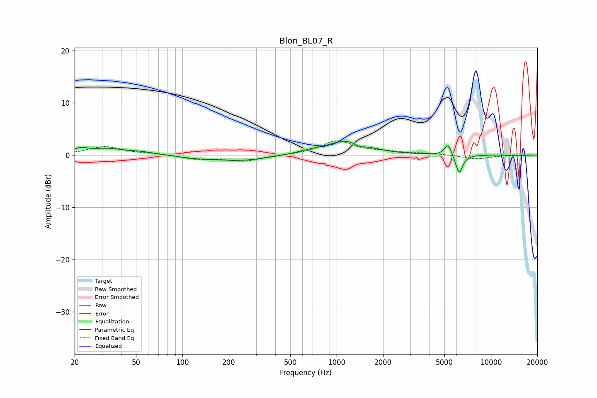

# Blon_BL07_R
See [usage instructions](https://github.com/jaakkopasanen/AutoEq#usage) for more options and info.

### Parametric EQs
Apply preamp of -2.7 dB when using parametric equalizer.

|   # | Type    |   Fc (Hz) |    Q |   Gain (dB) |
|-----|---------|-----------|------|-------------|
|   1 | Peaking |        22 | 3.1  |         0.9 |
|   2 | Peaking |        33 | 1.19 |         1.1 |
|   3 | Peaking |        55 | 1.7  |         0.4 |
|   4 | Peaking |       118 | 1.72 |        -0.3 |
|   5 | Peaking |       233 | 0.75 |        -1.1 |
|   6 | Peaking |       652 | 1.57 |         0.4 |
|   7 | Peaking |      1165 | 1.11 |         2.7 |
|   8 | Peaking |      1406 | 4.47 |        -0.7 |
|   9 | Peaking |      5283 | 6    |         2.3 |
|  10 | Peaking |      6232 | 5.93 |        -3.7 |

### Fixed Band EQs
When using fixed band (also called graphic) equalizer, apply preamp of **-2.8 dB** (if available) and set gains manually with these parameters.

|   # | Type    |   Fc (Hz) |    Q |   Gain (dB) |
|-----|---------|-----------|------|-------------|
|   1 | Peaking |        31 | 1.41 |         1.6 |
|   2 | Peaking |        62 | 1.41 |         0.3 |
|   3 | Peaking |       125 | 1.41 |        -0.7 |
|   4 | Peaking |       250 | 1.41 |        -1.1 |
|   5 | Peaking |       500 | 1.41 |        -0   |
|   6 | Peaking |      1000 | 1.41 |         2.6 |
|   7 | Peaking |      2000 | 1.41 |         0.5 |
|   8 | Peaking |      4000 | 1.41 |         0.3 |
|   9 | Peaking |      8000 | 1.41 |        -0.8 |
|  10 | Peaking |     16000 | 1.41 |        -0.1 |

### Graphs

