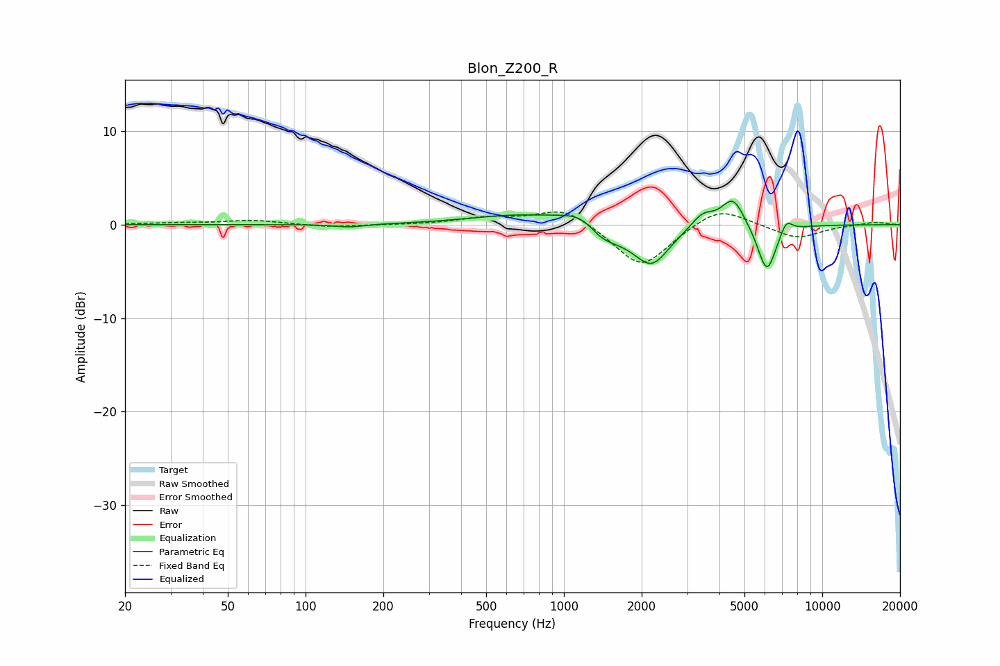

# Blon_Z200_R
See [usage instructions](https://github.com/jaakkopasanen/AutoEq#usage) for more options and info.

### Parametric EQs
Apply preamp of -2.6 dB when using parametric equalizer.

|   # | Type    |   Fc (Hz) |    Q |   Gain (dB) |
|-----|---------|-----------|------|-------------|
|   1 | Peaking |       148 | 2.41 |        -0.3 |
|   2 | Peaking |       662 | 0.74 |         1   |
|   3 | Peaking |      1228 | 1.68 |         1.9 |
|   4 | Peaking |      1384 | 2.44 |        -1.9 |
|   5 | Peaking |      1647 | 2.04 |        -0.7 |
|   6 | Peaking |      2184 | 2.03 |        -4.2 |
|   7 | Peaking |      3444 | 3.28 |         1.5 |
|   8 | Peaking |      4513 | 3.13 |         3.2 |
|   9 | Peaking |      6104 | 3.78 |        -5.2 |
|  10 | Peaking |      7257 | 5.91 |         1.4 |

### Fixed Band EQs
When using fixed band (also called graphic) equalizer, apply preamp of **-1.5 dB** (if available) and set gains manually with these parameters.

|   # | Type    |   Fc (Hz) |    Q |   Gain (dB) |
|-----|---------|-----------|------|-------------|
|   1 | Peaking |        31 | 1.41 |         0.2 |
|   2 | Peaking |        62 | 1.41 |         0.5 |
|   3 | Peaking |       125 | 1.41 |        -0.3 |
|   4 | Peaking |       250 | 1.41 |        -0   |
|   5 | Peaking |       500 | 1.41 |         0.7 |
|   6 | Peaking |      1000 | 1.41 |         1.9 |
|   7 | Peaking |      2000 | 1.41 |        -4.7 |
|   8 | Peaking |      4000 | 1.41 |         2.1 |
|   9 | Peaking |      8000 | 1.41 |        -1.5 |
|  10 | Peaking |     16000 | 1.41 |         0.3 |

### Graphs

