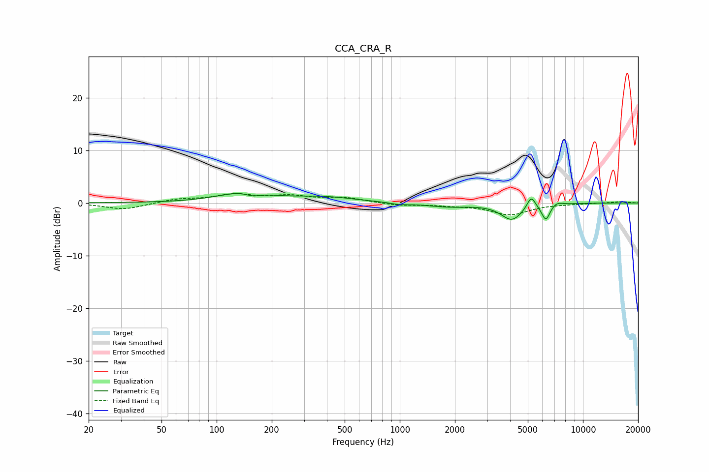

# CCA_CRA_R
See [usage instructions](https://github.com/jaakkopasanen/AutoEq#usage) for more options and info.

### Parametric EQs
Apply preamp of -1.9 dB when using parametric equalizer.

|   # | Type    |   Fc (Hz) |    Q |   Gain (dB) |
|-----|---------|-----------|------|-------------|
|   1 | Peaking |       141 | 1.02 |         1.9 |
|   2 | Peaking |       158 | 3.39 |        -0.7 |
|   3 | Peaking |       386 | 0.83 |         1   |
|   4 | Peaking |       996 | 2.91 |        -0.3 |
|   5 | Peaking |      1837 | 1.17 |        -0.7 |
|   6 | Peaking |      4090 | 2.39 |        -3.1 |
|   7 | Peaking |      5217 | 6    |         2.4 |
|   8 | Peaking |      6179 | 6    |        -0.6 |
|   9 | Peaking |      6293 | 6    |        -2.5 |
|  10 | Peaking |      7180 | 4.46 |         0.6 |

### Fixed Band EQs
When using fixed band (also called graphic) equalizer, apply preamp of **-1.9 dB** (if available) and set gains manually with these parameters.

|   # | Type    |   Fc (Hz) |    Q |   Gain (dB) |
|-----|---------|-----------|------|-------------|
|   1 | Peaking |        31 | 1.41 |        -1.3 |
|   2 | Peaking |        62 | 1.41 |         0.7 |
|   3 | Peaking |       125 | 1.41 |         1.4 |
|   4 | Peaking |       250 | 1.41 |         1.2 |
|   5 | Peaking |       500 | 1.41 |         0.9 |
|   6 | Peaking |      1000 | 1.41 |        -0.5 |
|   7 | Peaking |      2000 | 1.41 |        -0.3 |
|   8 | Peaking |      4000 | 1.41 |        -2.2 |
|   9 | Peaking |      8000 | 1.41 |        -0.1 |
|  10 | Peaking |     16000 | 1.41 |         0.3 |

### Graphs

