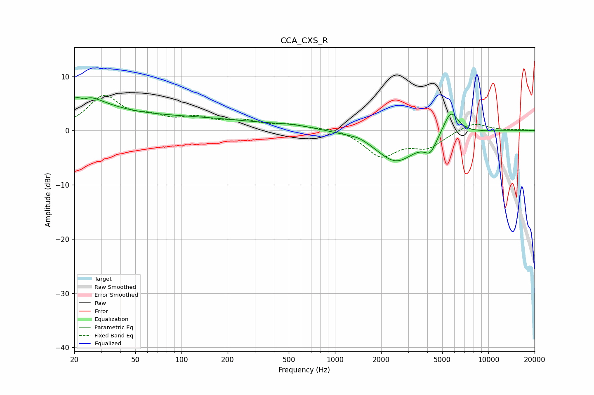

# CCA_CXS_R
See [usage instructions](https://github.com/jaakkopasanen/AutoEq#usage) for more options and info.

### Parametric EQs
Apply preamp of -6.2 dB when using parametric equalizer.

|   # | Type    |   Fc (Hz) |    Q |   Gain (dB) |
|-----|---------|-----------|------|-------------|
|   1 | Peaking |        23 | 0.97 |         5.4 |
|   2 | Peaking |        23 | 5.92 |        -3.9 |
|   3 | Peaking |        23 | 6    |         3.2 |
|   4 | Peaking |        28 | 1.36 |        -0.7 |
|   5 | Peaking |        73 | 0.21 |         2.5 |
|   6 | Peaking |       539 | 0.98 |         0.6 |
|   7 | Peaking |      1442 | 2.41 |         0.5 |
|   8 | Peaking |      2498 | 1.08 |        -5.7 |
|   9 | Peaking |      4183 | 3.58 |        -2.6 |
|  10 | Peaking |      5694 | 2.83 |         4.4 |

### Fixed Band EQs
When using fixed band (also called graphic) equalizer, apply preamp of **-6.6 dB** (if available) and set gains manually with these parameters.

|   # | Type    |   Fc (Hz) |    Q |   Gain (dB) |
|-----|---------|-----------|------|-------------|
|   1 | Peaking |        31 | 1.41 |         6.1 |
|   2 | Peaking |        62 | 1.41 |         1.8 |
|   3 | Peaking |       125 | 1.41 |         1.9 |
|   4 | Peaking |       250 | 1.41 |         1.5 |
|   5 | Peaking |       500 | 1.41 |         1   |
|   6 | Peaking |      1000 | 1.41 |         0.6 |
|   7 | Peaking |      2000 | 1.41 |        -4.6 |
|   8 | Peaking |      4000 | 1.41 |        -2.8 |
|   9 | Peaking |      8000 | 1.41 |         1.6 |
|  10 | Peaking |     16000 | 1.41 |         0.2 |

### Graphs

