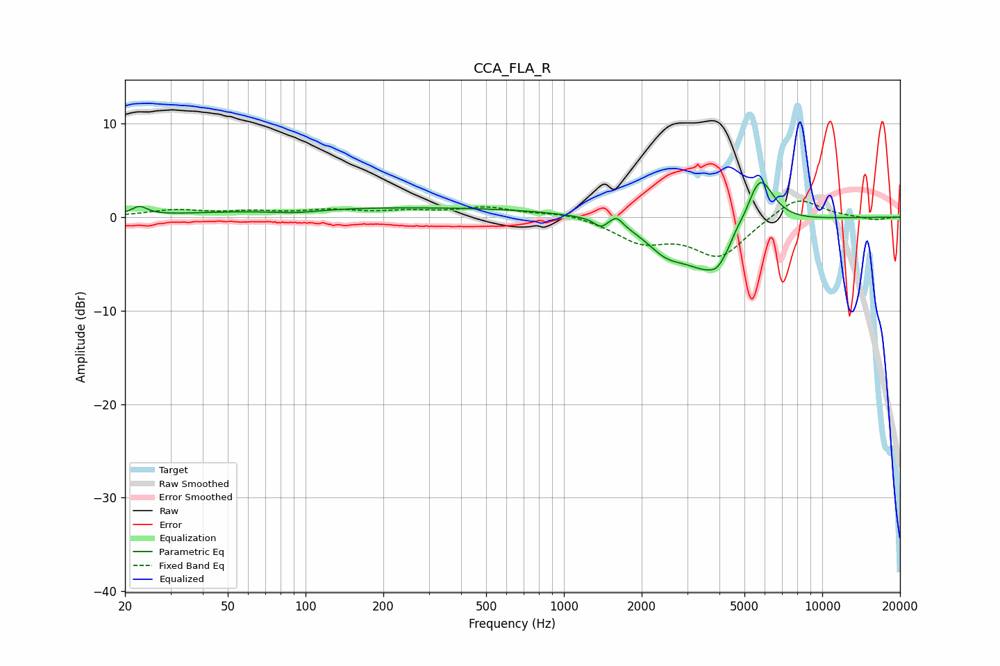

# CCA_FLA_R
See [usage instructions](https://github.com/jaakkopasanen/AutoEq#usage) for more options and info.

### Parametric EQs
Apply preamp of -3.8 dB when using parametric equalizer.

|   # | Type    |   Fc (Hz) |    Q |   Gain (dB) |
|-----|---------|-----------|------|-------------|
|   1 | Peaking |        23 | 4.75 |         0.9 |
|   2 | Peaking |        91 | 1.38 |        -0.4 |
|   3 | Peaking |       231 | 0.18 |         1   |
|   4 | Peaking |      1389 | 5.99 |        -0.8 |
|   5 | Peaking |      1598 | 6    |         1   |
|   6 | Peaking |      2476 | 1.83 |        -2.3 |
|   7 | Peaking |      3767 | 1.26 |        -5.8 |
|   8 | Peaking |      3919 | 6    |        -0.5 |
|   9 | Peaking |      4646 | 6    |         0.6 |
|  10 | Peaking |      5720 | 2.5  |         6.1 |

### Fixed Band EQs
When using fixed band (also called graphic) equalizer, apply preamp of **-1.8 dB** (if available) and set gains manually with these parameters.

|   # | Type    |   Fc (Hz) |    Q |   Gain (dB) |
|-----|---------|-----------|------|-------------|
|   1 | Peaking |        31 | 1.41 |         0.7 |
|   2 | Peaking |        62 | 1.41 |         0.5 |
|   3 | Peaking |       125 | 1.41 |         0.6 |
|   4 | Peaking |       250 | 1.41 |         0.5 |
|   5 | Peaking |       500 | 1.41 |         1   |
|   6 | Peaking |      1000 | 1.41 |         0.5 |
|   7 | Peaking |      2000 | 1.41 |        -2.4 |
|   8 | Peaking |      4000 | 1.41 |        -4.1 |
|   9 | Peaking |      8000 | 1.41 |         2.4 |
|  10 | Peaking |     16000 | 1.41 |        -0.3 |

### Graphs

