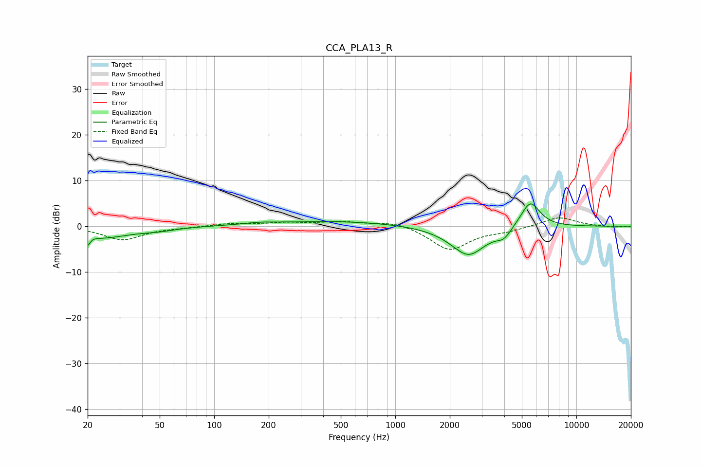

# CCA_PLA13_R
See [usage instructions](https://github.com/jaakkopasanen/AutoEq#usage) for more options and info.

### Parametric EQs
Apply preamp of -5.0 dB when using parametric equalizer.

|   # | Type    |   Fc (Hz) |    Q |   Gain (dB) |
|-----|---------|-----------|------|-------------|
|   1 | Peaking |        20 | 5.91 |        -3   |
|   2 | Peaking |        21 | 6    |         1.3 |
|   3 | Peaking |        24 | 0.87 |        -2.4 |
|   4 | Peaking |        50 | 1.58 |        -0.5 |
|   5 | Peaking |       179 | 1.64 |         0.4 |
|   6 | Peaking |       474 | 0.4  |         1.1 |
|   7 | Peaking |      2527 | 1.37 |        -6.1 |
|   8 | Peaking |      2568 | 3.06 |        -0.4 |
|   9 | Peaking |      3977 | 3.56 |        -1.9 |
|  10 | Peaking |      5561 | 2.56 |         5.9 |

### Fixed Band EQs
When using fixed band (also called graphic) equalizer, apply preamp of **-1.9 dB** (if available) and set gains manually with these parameters.

|   # | Type    |   Fc (Hz) |    Q |   Gain (dB) |
|-----|---------|-----------|------|-------------|
|   1 | Peaking |        31 | 1.41 |        -2.9 |
|   2 | Peaking |        62 | 1.41 |        -0.2 |
|   3 | Peaking |       125 | 1.41 |         0.6 |
|   4 | Peaking |       250 | 1.41 |         0.7 |
|   5 | Peaking |       500 | 1.41 |         0.9 |
|   6 | Peaking |      1000 | 1.41 |         1.1 |
|   7 | Peaking |      2000 | 1.41 |        -5.2 |
|   8 | Peaking |      4000 | 1.41 |        -0.9 |
|   9 | Peaking |      8000 | 1.41 |         2.1 |
|  10 | Peaking |     16000 | 1.41 |        -0.3 |

### Graphs

