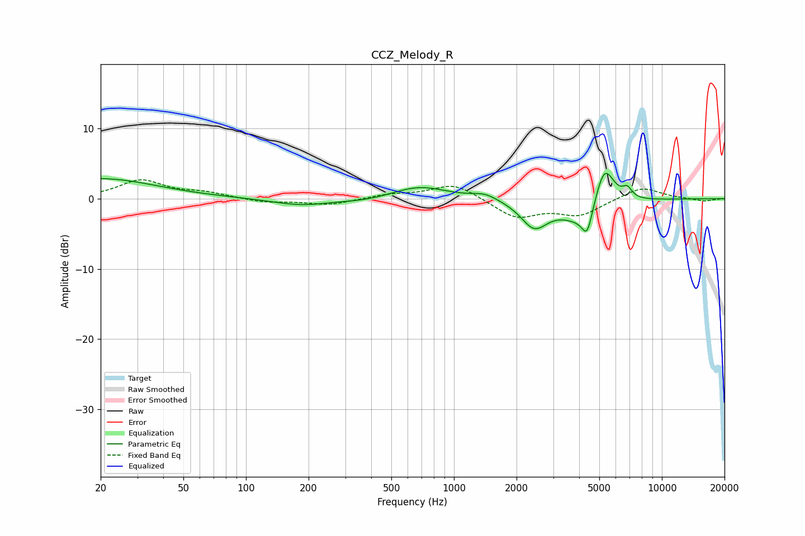

# CCZ_Melody_R
See [usage instructions](https://github.com/jaakkopasanen/AutoEq#usage) for more options and info.

### Parametric EQs
Apply preamp of -3.7 dB when using parametric equalizer.

|   # | Type    |   Fc (Hz) |    Q |   Gain (dB) |
|-----|---------|-----------|------|-------------|
|   1 | Peaking |        20 | 0.54 |         2.9 |
|   2 | Peaking |       184 | 1.02 |        -1   |
|   3 | Peaking |       379 | 1.17 |        -0.4 |
|   4 | Peaking |       683 | 1.07 |         1.8 |
|   5 | Peaking |      1410 | 2.3  |         0.8 |
|   6 | Peaking |      2432 | 2.22 |        -3.7 |
|   7 | Peaking |      4308 | 1.38 |        -3.9 |
|   8 | Peaking |      4372 | 5.9  |        -3.2 |
|   9 | Peaking |      5278 | 2.8  |         6.9 |
|  10 | Peaking |      6819 | 6    |         1.4 |

### Fixed Band EQs
When using fixed band (also called graphic) equalizer, apply preamp of **-2.8 dB** (if available) and set gains manually with these parameters.

|   # | Type    |   Fc (Hz) |    Q |   Gain (dB) |
|-----|---------|-----------|------|-------------|
|   1 | Peaking |        31 | 1.41 |         2.6 |
|   2 | Peaking |        62 | 1.41 |         0.8 |
|   3 | Peaking |       125 | 1.41 |        -0.5 |
|   4 | Peaking |       250 | 1.41 |        -0.9 |
|   5 | Peaking |       500 | 1.41 |         0.6 |
|   6 | Peaking |      1000 | 1.41 |         2.2 |
|   7 | Peaking |      2000 | 1.41 |        -2.7 |
|   8 | Peaking |      4000 | 1.41 |        -2.2 |
|   9 | Peaking |      8000 | 1.41 |         1.7 |
|  10 | Peaking |     16000 | 1.41 |        -0.4 |

### Graphs

