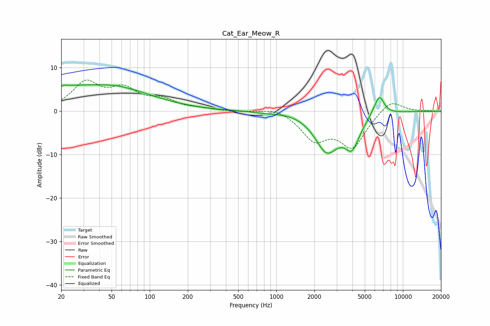

# Cat_Ear_Meow_R
See [usage instructions](https://github.com/jaakkopasanen/AutoEq#usage) for more options and info.

### Parametric EQs
Apply preamp of -6.2 dB when using parametric equalizer.

|   # | Type    |   Fc (Hz) |    Q |   Gain (dB) |
|-----|---------|-----------|------|-------------|
|   1 | Peaking |        20 | 5.79 |        -3.4 |
|   2 | Peaking |        20 | 5.89 |         3.3 |
|   3 | Peaking |        21 | 0.2  |         5.5 |
|   4 | Peaking |        57 | 0.71 |         1.2 |
|   5 | Peaking |       828 | 1.37 |        -0.4 |
|   6 | Peaking |      2041 | 0.62 |         1.7 |
|   7 | Peaking |      2500 | 1.32 |       -10.2 |
|   8 | Peaking |      3970 | 2.39 |        -6.4 |
|   9 | Peaking |      5821 | 5.97 |         0.5 |
|  10 | Peaking |      6527 | 3.69 |         4.5 |

### Fixed Band EQs
When using fixed band (also called graphic) equalizer, apply preamp of **-7.3 dB** (if available) and set gains manually with these parameters.

|   # | Type    |   Fc (Hz) |    Q |   Gain (dB) |
|-----|---------|-----------|------|-------------|
|   1 | Peaking |        31 | 1.41 |         6.2 |
|   2 | Peaking |        62 | 1.41 |         4.4 |
|   3 | Peaking |       125 | 1.41 |         2.3 |
|   4 | Peaking |       250 | 1.41 |         0.4 |
|   5 | Peaking |       500 | 1.41 |        -0.1 |
|   6 | Peaking |      1000 | 1.41 |         1   |
|   7 | Peaking |      2000 | 1.41 |        -6   |
|   8 | Peaking |      4000 | 1.41 |        -7.9 |
|   9 | Peaking |      8000 | 1.41 |         3   |
|  10 | Peaking |     16000 | 1.41 |         0   |

### Graphs

