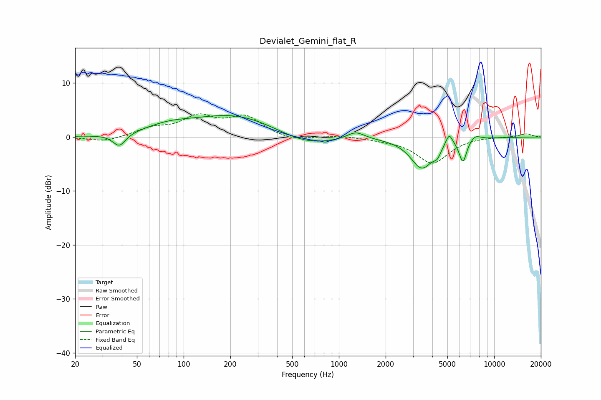

# Devialet_Gemini_flat_R
See [usage instructions](https://github.com/jaakkopasanen/AutoEq#usage) for more options and info.

### Parametric EQs
Apply preamp of -4.1 dB when using parametric equalizer.

|   # | Type    |   Fc (Hz) |    Q |   Gain (dB) |
|-----|---------|-----------|------|-------------|
|   1 | Peaking |        38 | 3.47 |        -2.4 |
|   2 | Peaking |        79 | 0.97 |         1.4 |
|   3 | Peaking |       217 | 0.5  |         4.2 |
|   4 | Peaking |       606 | 0.76 |        -2.3 |
|   5 | Peaking |      1284 | 2.45 |         1.5 |
|   6 | Peaking |      3422 | 1.94 |        -5.6 |
|   7 | Peaking |      4295 | 5.99 |        -1.3 |
|   8 | Peaking |      5126 | 6    |         2.3 |
|   9 | Peaking |      6292 | 5.79 |        -4.2 |
|  10 | Peaking |      7562 | 4.16 |         0.9 |

### Fixed Band EQs
When using fixed band (also called graphic) equalizer, apply preamp of **-4.4 dB** (if available) and set gains manually with these parameters.

|   # | Type    |   Fc (Hz) |    Q |   Gain (dB) |
|-----|---------|-----------|------|-------------|
|   1 | Peaking |        31 | 1.41 |        -0.9 |
|   2 | Peaking |        62 | 1.41 |         1.4 |
|   3 | Peaking |       125 | 1.41 |         3.4 |
|   4 | Peaking |       250 | 1.41 |         3.5 |
|   5 | Peaking |       500 | 1.41 |        -0.8 |
|   6 | Peaking |      1000 | 1.41 |         0.3 |
|   7 | Peaking |      2000 | 1.41 |        -0.3 |
|   8 | Peaking |      4000 | 1.41 |        -4.8 |
|   9 | Peaking |      8000 | 1.41 |         0.1 |
|  10 | Peaking |     16000 | 1.41 |         0.6 |

### Graphs

