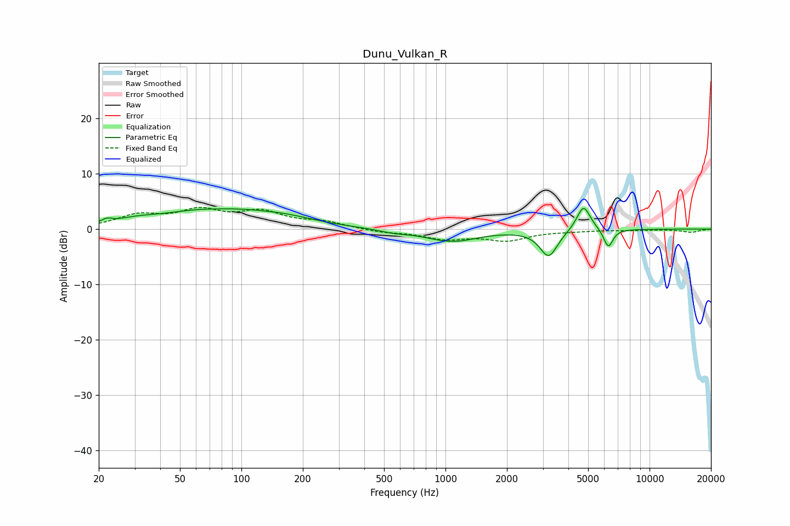

# Dunu_Vulkan_R
See [usage instructions](https://github.com/jaakkopasanen/AutoEq#usage) for more options and info.

### Parametric EQs
Apply preamp of -3.8 dB when using parametric equalizer.

|   # | Type    |   Fc (Hz) |    Q |   Gain (dB) |
|-----|---------|-----------|------|-------------|
|   1 | Peaking |        22 | 5.98 |         0.7 |
|   2 | Peaking |        30 | 1.45 |         0.7 |
|   3 | Peaking |        77 | 0.51 |         3.6 |
|   4 | Peaking |        78 | 1.9  |        -0.2 |
|   5 | Peaking |       169 | 1.07 |         0.7 |
|   6 | Peaking |       560 | 1.98 |        -0.5 |
|   7 | Peaking |      1074 | 1.1  |        -2.2 |
|   8 | Peaking |      3204 | 3.26 |        -4.9 |
|   9 | Peaking |      4748 | 4.14 |         4.6 |
|  10 | Peaking |      6277 | 5.98 |        -3.4 |

### Fixed Band EQs
When using fixed band (also called graphic) equalizer, apply preamp of **-4.0 dB** (if available) and set gains manually with these parameters.

|   # | Type    |   Fc (Hz) |    Q |   Gain (dB) |
|-----|---------|-----------|------|-------------|
|   1 | Peaking |        31 | 1.41 |         2.3 |
|   2 | Peaking |        62 | 1.41 |         3   |
|   3 | Peaking |       125 | 1.41 |         2.8 |
|   4 | Peaking |       250 | 1.41 |         1.1 |
|   5 | Peaking |       500 | 1.41 |        -0.5 |
|   6 | Peaking |      1000 | 1.41 |        -1.6 |
|   7 | Peaking |      2000 | 1.41 |        -1.9 |
|   8 | Peaking |      4000 | 1.41 |        -0.2 |
|   9 | Peaking |      8000 | 1.41 |        -0.2 |
|  10 | Peaking |     16000 | 1.41 |        -0.6 |

### Graphs

