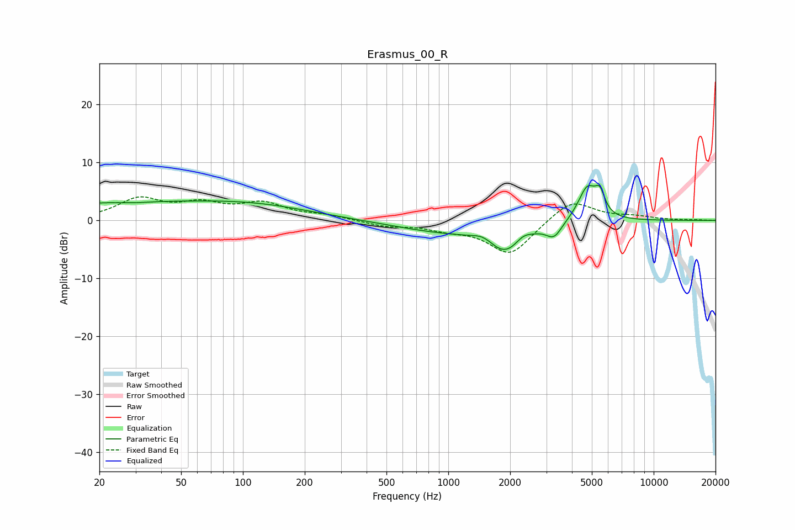

# Erasmus_00_R
See [usage instructions](https://github.com/jaakkopasanen/AutoEq#usage) for more options and info.

### Parametric EQs
Apply preamp of -6.1 dB when using parametric equalizer.

|   # | Type    |   Fc (Hz) |    Q |   Gain (dB) |
|-----|---------|-----------|------|-------------|
|   1 | Peaking |        24 | 0.25 |         2.9 |
|   2 | Peaking |        30 | 2.46 |        -0.2 |
|   3 | Peaking |       122 | 0.51 |         1.9 |
|   4 | Peaking |       951 | 0.58 |        -1.8 |
|   5 | Peaking |      1482 | 2.85 |         1.1 |
|   6 | Peaking |      1891 | 1.63 |        -4.7 |
|   7 | Peaking |      2311 | 3.82 |         1   |
|   8 | Peaking |      3272 | 3.72 |        -2.4 |
|   9 | Peaking |      4755 | 3.04 |         5.9 |
|  10 | Peaking |      5474 | 6    |         3.2 |

### Fixed Band EQs
When using fixed band (also called graphic) equalizer, apply preamp of **-4.2 dB** (if available) and set gains manually with these parameters.

|   # | Type    |   Fc (Hz) |    Q |   Gain (dB) |
|-----|---------|-----------|------|-------------|
|   1 | Peaking |        31 | 1.41 |         3.5 |
|   2 | Peaking |        62 | 1.41 |         2.4 |
|   3 | Peaking |       125 | 1.41 |         2.7 |
|   4 | Peaking |       250 | 1.41 |         0.8 |
|   5 | Peaking |       500 | 1.41 |        -0.9 |
|   6 | Peaking |      1000 | 1.41 |        -1.2 |
|   7 | Peaking |      2000 | 1.41 |        -5.9 |
|   8 | Peaking |      4000 | 1.41 |         3.8 |
|   9 | Peaking |      8000 | 1.41 |         0.6 |
|  10 | Peaking |     16000 | 1.41 |         0.1 |

### Graphs

