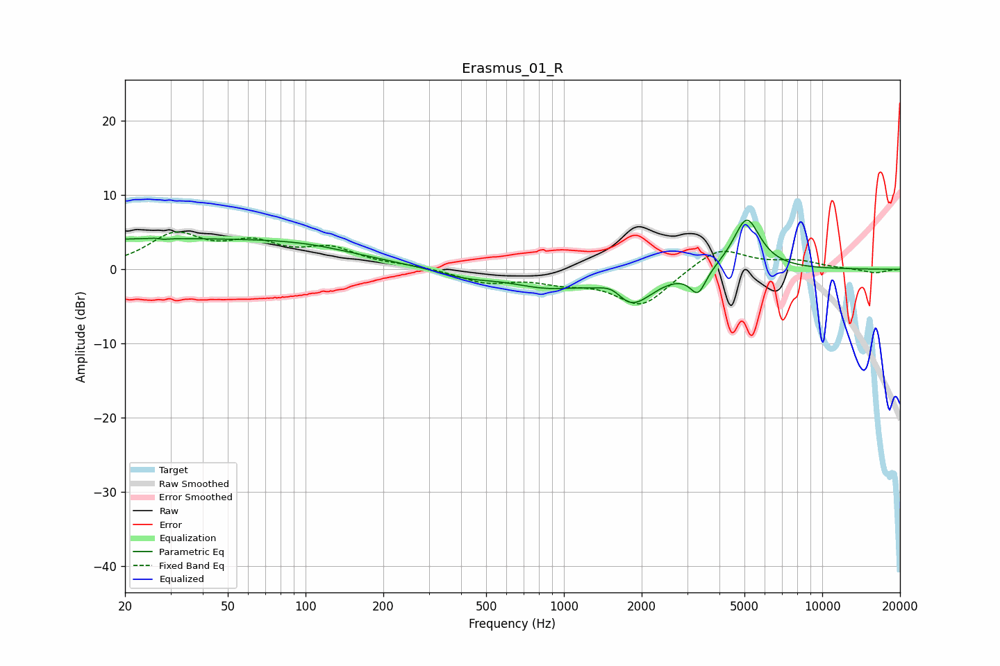

# Erasmus_01_R
See [usage instructions](https://github.com/jaakkopasanen/AutoEq#usage) for more options and info.

### Parametric EQs
Apply preamp of -6.7 dB when using parametric equalizer.

|   # | Type    |   Fc (Hz) |    Q |   Gain (dB) |
|-----|---------|-----------|------|-------------|
|   1 | Peaking |        24 | 0.18 |         4   |
|   2 | Peaking |        27 | 5.78 |         2.5 |
|   3 | Peaking |        28 | 5.94 |        -2.5 |
|   4 | Peaking |       103 | 0.7  |         0.9 |
|   5 | Peaking |       420 | 1.23 |        -1   |
|   6 | Peaking |       852 | 1.01 |        -2   |
|   7 | Peaking |      1552 | 2.8  |         1.9 |
|   8 | Peaking |      1787 | 1.64 |        -5.1 |
|   9 | Peaking |      3306 | 4.56 |        -3.2 |
|  10 | Peaking |      5099 | 2.63 |         7.1 |

### Fixed Band EQs
When using fixed band (also called graphic) equalizer, apply preamp of **-5.1 dB** (if available) and set gains manually with these parameters.

|   # | Type    |   Fc (Hz) |    Q |   Gain (dB) |
|-----|---------|-----------|------|-------------|
|   1 | Peaking |        31 | 1.41 |         4.4 |
|   2 | Peaking |        62 | 1.41 |         2.9 |
|   3 | Peaking |       125 | 1.41 |         2.5 |
|   4 | Peaking |       250 | 1.41 |         0.4 |
|   5 | Peaking |       500 | 1.41 |        -1.7 |
|   6 | Peaking |      1000 | 1.41 |        -1.3 |
|   7 | Peaking |      2000 | 1.41 |        -4.9 |
|   8 | Peaking |      4000 | 1.41 |         3.1 |
|   9 | Peaking |      8000 | 1.41 |         1   |
|  10 | Peaking |     16000 | 1.41 |        -0.5 |

### Graphs

