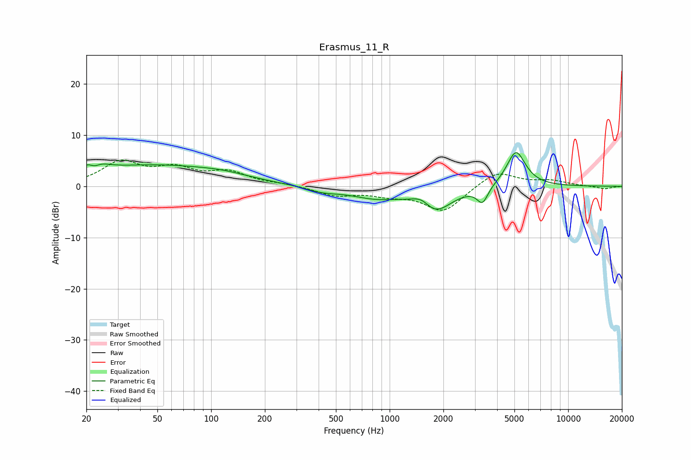

# Erasmus_11_R
See [usage instructions](https://github.com/jaakkopasanen/AutoEq#usage) for more options and info.

### Parametric EQs
Apply preamp of -6.7 dB when using parametric equalizer.

|   # | Type    |   Fc (Hz) |    Q |   Gain (dB) |
|-----|---------|-----------|------|-------------|
|   1 | Peaking |        22 | 2.66 |         3.8 |
|   2 | Peaking |        22 | 4.09 |        -2.6 |
|   3 | Peaking |        47 | 0.38 |         3.9 |
|   4 | Peaking |       117 | 0.92 |         0.8 |
|   5 | Peaking |       418 | 1.55 |        -0.9 |
|   6 | Peaking |       834 | 0.98 |        -2   |
|   7 | Peaking |      1515 | 2.7  |         2   |
|   8 | Peaking |      1775 | 1.51 |        -5   |
|   9 | Peaking |      3312 | 4.64 |        -3.1 |
|  10 | Peaking |      5104 | 2.6  |         7.1 |

### Fixed Band EQs
When using fixed band (also called graphic) equalizer, apply preamp of **-5.2 dB** (if available) and set gains manually with these parameters.

|   # | Type    |   Fc (Hz) |    Q |   Gain (dB) |
|-----|---------|-----------|------|-------------|
|   1 | Peaking |        31 | 1.41 |         4.5 |
|   2 | Peaking |        62 | 1.41 |         3   |
|   3 | Peaking |       125 | 1.41 |         2.5 |
|   4 | Peaking |       250 | 1.41 |         0.4 |
|   5 | Peaking |       500 | 1.41 |        -1.7 |
|   6 | Peaking |      1000 | 1.41 |        -1.4 |
|   7 | Peaking |      2000 | 1.41 |        -4.9 |
|   8 | Peaking |      4000 | 1.41 |         3.1 |
|   9 | Peaking |      8000 | 1.41 |         1   |
|  10 | Peaking |     16000 | 1.41 |        -0.5 |

### Graphs

