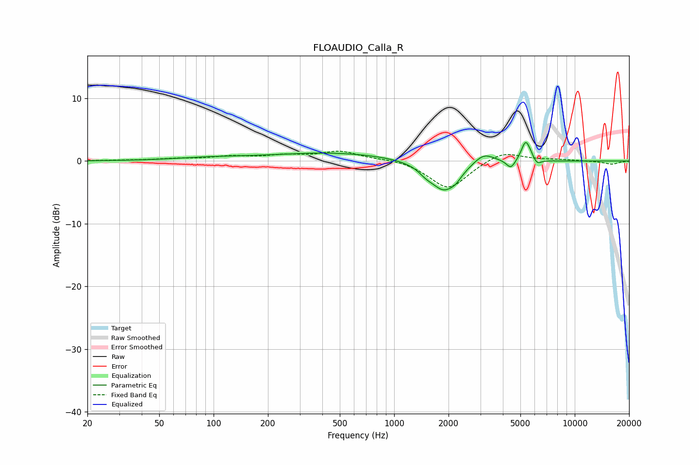

# FLOAUDIO_Calla_R
See [usage instructions](https://github.com/jaakkopasanen/AutoEq#usage) for more options and info.

### Parametric EQs
Apply preamp of -3.1 dB when using parametric equalizer.

|   # | Type    |   Fc (Hz) |    Q |   Gain (dB) |
|-----|---------|-----------|------|-------------|
|   1 | Peaking |        97 | 0.7  |         0.4 |
|   2 | Peaking |       457 | 0.42 |         1.3 |
|   3 | Peaking |      1498 | 3.79 |        -0.7 |
|   4 | Peaking |      1897 | 1.8  |        -4.9 |
|   5 | Peaking |      2203 | 5.33 |        -0.5 |
|   6 | Peaking |      3131 | 2.43 |         1.7 |
|   7 | Peaking |      4428 | 5.81 |        -1.4 |
|   8 | Peaking |      5333 | 5.98 |         2.9 |
|   9 | Peaking |      5666 | 6    |         0.7 |
|  10 | Peaking |      6157 | 6    |        -1   |

### Fixed Band EQs
When using fixed band (also called graphic) equalizer, apply preamp of **-1.7 dB** (if available) and set gains manually with these parameters.

|   # | Type    |   Fc (Hz) |    Q |   Gain (dB) |
|-----|---------|-----------|------|-------------|
|   1 | Peaking |        31 | 1.41 |         0.1 |
|   2 | Peaking |        62 | 1.41 |         0.3 |
|   3 | Peaking |       125 | 1.41 |         0.6 |
|   4 | Peaking |       250 | 1.41 |         0.8 |
|   5 | Peaking |       500 | 1.41 |         1.5 |
|   6 | Peaking |      1000 | 1.41 |         0.4 |
|   7 | Peaking |      2000 | 1.41 |        -4.5 |
|   8 | Peaking |      4000 | 1.41 |         1.7 |
|   9 | Peaking |      8000 | 1.41 |         0.2 |
|  10 | Peaking |     16000 | 1.41 |        -0.5 |

### Graphs

