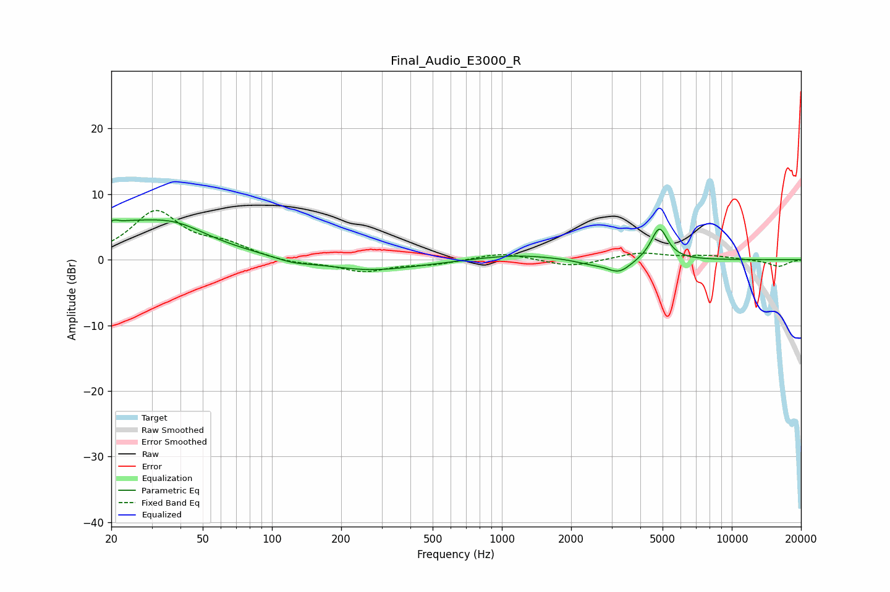

# Final_Audio_E3000_R
See [usage instructions](https://github.com/jaakkopasanen/AutoEq#usage) for more options and info.

### Parametric EQs
Apply preamp of -6.2 dB when using parametric equalizer.

|   # | Type    |   Fc (Hz) |    Q |   Gain (dB) |
|-----|---------|-----------|------|-------------|
|   1 | Peaking |        21 | 5.68 |         3.4 |
|   2 | Peaking |        21 | 6    |        -2.8 |
|   3 | Peaking |        25 | 0.52 |         5.3 |
|   4 | Peaking |        39 | 1.22 |         1.4 |
|   5 | Peaking |       123 | 1.95 |        -0.6 |
|   6 | Peaking |       267 | 0.68 |        -1.7 |
|   7 | Peaking |      1148 | 0.85 |         0.8 |
|   8 | Peaking |      2428 | 2.01 |        -0.6 |
|   9 | Peaking |      3234 | 2.65 |        -2   |
|  10 | Peaking |      4839 | 3.9  |         5   |

### Fixed Band EQs
When using fixed band (also called graphic) equalizer, apply preamp of **-7.6 dB** (if available) and set gains manually with these parameters.

|   # | Type    |   Fc (Hz) |    Q |   Gain (dB) |
|-----|---------|-----------|------|-------------|
|   1 | Peaking |        31 | 1.41 |         7.2 |
|   2 | Peaking |        62 | 1.41 |         1.9 |
|   3 | Peaking |       125 | 1.41 |        -0.6 |
|   4 | Peaking |       250 | 1.41 |        -1.8 |
|   5 | Peaking |       500 | 1.41 |        -0.6 |
|   6 | Peaking |      1000 | 1.41 |         1.1 |
|   7 | Peaking |      2000 | 1.41 |        -1.1 |
|   8 | Peaking |      4000 | 1.41 |         1.1 |
|   9 | Peaking |      8000 | 1.41 |         0.6 |
|  10 | Peaking |     16000 | 1.41 |        -1   |

### Graphs

