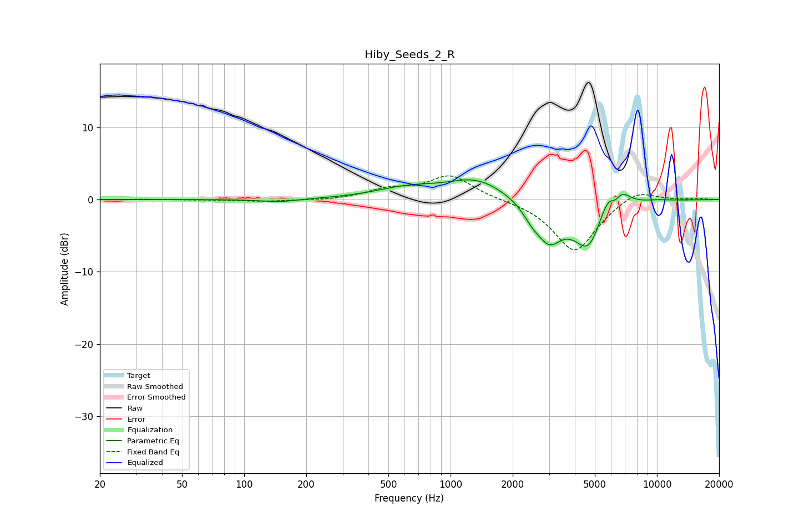

# Hiby_Seeds_2_R
See [usage instructions](https://github.com/jaakkopasanen/AutoEq#usage) for more options and info.

### Parametric EQs
Apply preamp of -2.8 dB when using parametric equalizer.

|   # | Type    |   Fc (Hz) |    Q |   Gain (dB) |
|-----|---------|-----------|------|-------------|
|   1 | Peaking |       146 | 1.68 |        -0.4 |
|   2 | Peaking |       621 | 0.89 |         1.4 |
|   3 | Peaking |      1343 | 1.02 |         2.7 |
|   4 | Peaking |      2474 | 3.23 |        -1.3 |
|   5 | Peaking |      2999 | 2.2  |        -4.9 |
|   6 | Peaking |      4694 | 1.84 |        -7.1 |
|   7 | Peaking |      5835 | 2.47 |         3.9 |
|   8 | Peaking |      6253 | 5.99 |        -1.2 |
|   9 | Peaking |      6767 | 3.32 |         1.3 |
|  10 | Peaking |     10000 | 2.22 |         0.2 |

### Fixed Band EQs
When using fixed band (also called graphic) equalizer, apply preamp of **-3.4 dB** (if available) and set gains manually with these parameters.

|   # | Type    |   Fc (Hz) |    Q |   Gain (dB) |
|-----|---------|-----------|------|-------------|
|   1 | Peaking |        31 | 1.41 |         0.1 |
|   2 | Peaking |        62 | 1.41 |        -0   |
|   3 | Peaking |       125 | 1.41 |        -0.3 |
|   4 | Peaking |       250 | 1.41 |        -0.1 |
|   5 | Peaking |       500 | 1.41 |         1.3 |
|   6 | Peaking |      1000 | 1.41 |         3.3 |
|   7 | Peaking |      2000 | 1.41 |        -0   |
|   8 | Peaking |      4000 | 1.41 |        -7.3 |
|   9 | Peaking |      8000 | 1.41 |         1.6 |
|  10 | Peaking |     16000 | 1.41 |         0.1 |

### Graphs

