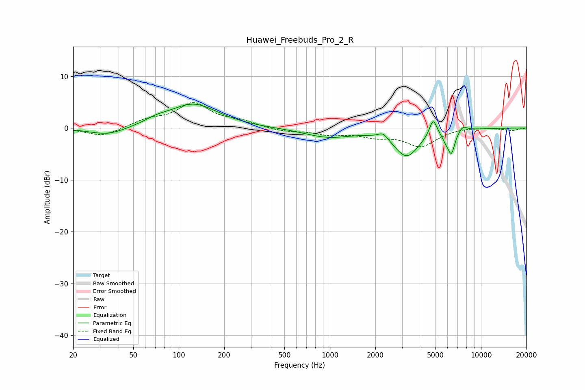

# Huawei_Freebuds_Pro_2_R
See [usage instructions](https://github.com/jaakkopasanen/AutoEq#usage) for more options and info.

### Parametric EQs
Apply preamp of -4.7 dB when using parametric equalizer.

|   # | Type    |   Fc (Hz) |    Q |   Gain (dB) |
|-----|---------|-----------|------|-------------|
|   1 | Peaking |        34 | 1.16 |        -1.5 |
|   2 | Peaking |        71 | 1.98 |         0.7 |
|   3 | Peaking |       125 | 0.87 |         4.6 |
|   4 | Peaking |       973 | 0.9  |        -1.7 |
|   5 | Peaking |      2249 | 4.51 |         1.2 |
|   6 | Peaking |      3226 | 1.72 |        -5.3 |
|   7 | Peaking |      4820 | 5.69 |         3.4 |
|   8 | Peaking |      5858 | 6    |        -1.2 |
|   9 | Peaking |      6371 | 5.96 |        -4.2 |
|  10 | Peaking |      7608 | 4.86 |         1.1 |

### Fixed Band EQs
When using fixed band (also called graphic) equalizer, apply preamp of **-5.0 dB** (if available) and set gains manually with these parameters.

|   # | Type    |   Fc (Hz) |    Q |   Gain (dB) |
|-----|---------|-----------|------|-------------|
|   1 | Peaking |        31 | 1.41 |        -1.7 |
|   2 | Peaking |        62 | 1.41 |         1.4 |
|   3 | Peaking |       125 | 1.41 |         4.6 |
|   4 | Peaking |       250 | 1.41 |         1.1 |
|   5 | Peaking |       500 | 1.41 |        -0.7 |
|   6 | Peaking |      1000 | 1.41 |        -1.1 |
|   7 | Peaking |      2000 | 1.41 |        -1.3 |
|   8 | Peaking |      4000 | 1.41 |        -3.4 |
|   9 | Peaking |      8000 | 1.41 |         0.2 |
|  10 | Peaking |     16000 | 1.41 |        -0.5 |

### Graphs

