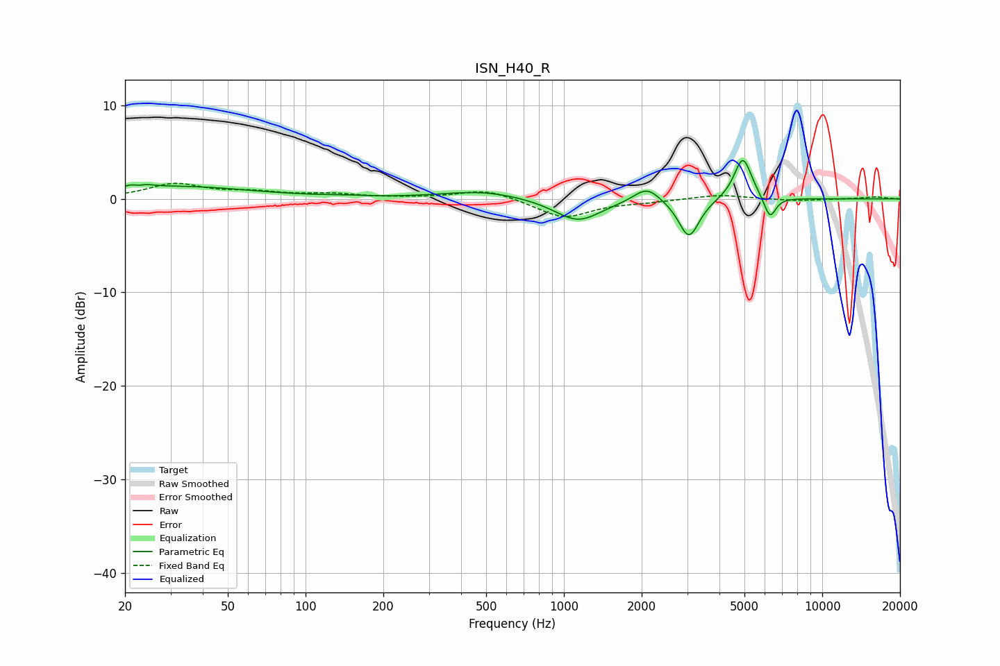

# ISN_H40_R
See [usage instructions](https://github.com/jaakkopasanen/AutoEq#usage) for more options and info.

### Parametric EQs
Apply preamp of -4.2 dB when using parametric equalizer.

|   # | Type    |   Fc (Hz) |    Q |   Gain (dB) |
|-----|---------|-----------|------|-------------|
|   1 | Peaking |        22 | 4.07 |         1.3 |
|   2 | Peaking |        23 | 5.63 |        -0.9 |
|   3 | Peaking |        33 | 0.5  |         1.3 |
|   4 | Peaking |       140 | 1.88 |         0.1 |
|   5 | Peaking |       484 | 0.91 |         0.9 |
|   6 | Peaking |      1133 | 1.57 |        -2.4 |
|   7 | Peaking |      2094 | 2.8  |         1.7 |
|   8 | Peaking |      3048 | 3.54 |        -4.2 |
|   9 | Peaking |      4929 | 4.1  |         4.6 |
|  10 | Peaking |      6273 | 6    |        -2.4 |

### Fixed Band EQs
When using fixed band (also called graphic) equalizer, apply preamp of **-1.8 dB** (if available) and set gains manually with these parameters.

|   # | Type    |   Fc (Hz) |    Q |   Gain (dB) |
|-----|---------|-----------|------|-------------|
|   1 | Peaking |        31 | 1.41 |         1.5 |
|   2 | Peaking |        62 | 1.41 |         0.6 |
|   3 | Peaking |       125 | 1.41 |         0.5 |
|   4 | Peaking |       250 | 1.41 |         0.1 |
|   5 | Peaking |       500 | 1.41 |         1.1 |
|   6 | Peaking |      1000 | 1.41 |        -2   |
|   7 | Peaking |      2000 | 1.41 |        -0.3 |
|   8 | Peaking |      4000 | 1.41 |         0.5 |
|   9 | Peaking |      8000 | 1.41 |        -0.2 |
|  10 | Peaking |     16000 | 1.41 |         0.2 |

### Graphs

