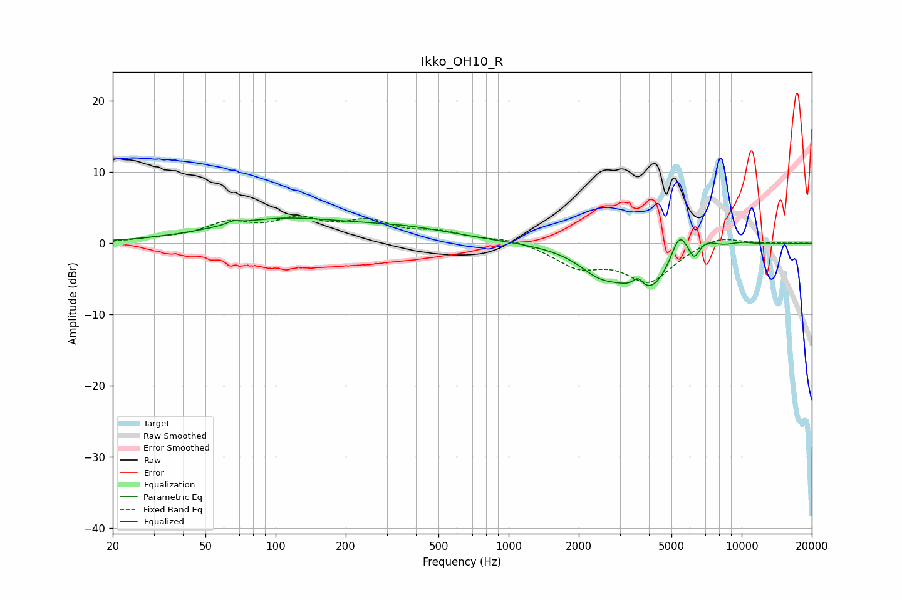

# Ikko_OH10_R
See [usage instructions](https://github.com/jaakkopasanen/AutoEq#usage) for more options and info.

### Parametric EQs
Apply preamp of -3.7 dB when using parametric equalizer.

|   # | Type    |   Fc (Hz) |    Q |   Gain (dB) |
|-----|---------|-----------|------|-------------|
|   1 | Peaking |        66 | 5.56 |         0.4 |
|   2 | Peaking |       103 | 0.5  |         3.1 |
|   3 | Peaking |       360 | 0.59 |         1.7 |
|   4 | Peaking |      2461 | 1.55 |        -2.8 |
|   5 | Peaking |      3593 | 6    |         1.7 |
|   6 | Peaking |      3985 | 1.26 |        -6.5 |
|   7 | Peaking |      5398 | 3.61 |         4.5 |
|   8 | Peaking |      6259 | 6    |        -2   |
|   9 | Peaking |      6987 | 2.81 |         1.5 |
|  10 | Peaking |      9991 | 2.13 |         0.5 |

### Fixed Band EQs
When using fixed band (also called graphic) equalizer, apply preamp of **-3.9 dB** (if available) and set gains manually with these parameters.

|   # | Type    |   Fc (Hz) |    Q |   Gain (dB) |
|-----|---------|-----------|------|-------------|
|   1 | Peaking |        31 | 1.41 |         0.4 |
|   2 | Peaking |        62 | 1.41 |         2.5 |
|   3 | Peaking |       125 | 1.41 |         2.9 |
|   4 | Peaking |       250 | 1.41 |         2.6 |
|   5 | Peaking |       500 | 1.41 |         1.3 |
|   6 | Peaking |      1000 | 1.41 |         0.7 |
|   7 | Peaking |      2000 | 1.41 |        -3   |
|   8 | Peaking |      4000 | 1.41 |        -5.2 |
|   9 | Peaking |      8000 | 1.41 |         1.3 |
|  10 | Peaking |     16000 | 1.41 |         0   |

### Graphs

