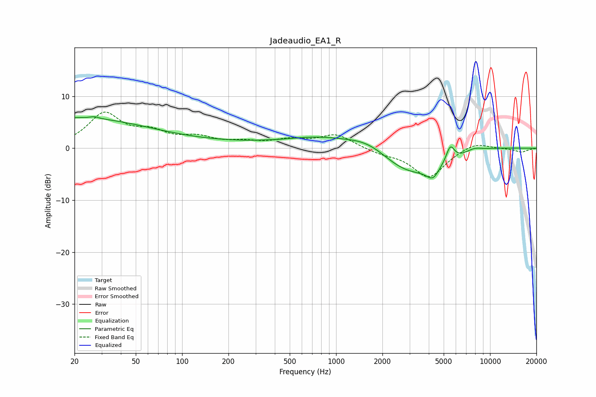

# Jadeaudio_EA1_R
See [usage instructions](https://github.com/jaakkopasanen/AutoEq#usage) for more options and info.

### Parametric EQs
Apply preamp of -6.2 dB when using parametric equalizer.

|   # | Type    |   Fc (Hz) |    Q |   Gain (dB) |
|-----|---------|-----------|------|-------------|
|   1 | Peaking |        20 | 0.28 |         5.8 |
|   2 | Peaking |        27 | 5.51 |         0.3 |
|   3 | Peaking |       316 | 0.25 |         0.9 |
|   4 | Peaking |       766 | 0.74 |         1.4 |
|   5 | Peaking |      1656 | 0.87 |         3.6 |
|   6 | Peaking |      2852 | 0.61 |        -6.1 |
|   7 | Peaking |      4253 | 3.4  |        -2.4 |
|   8 | Peaking |      5518 | 5.19 |         3.1 |
|   9 | Peaking |      7846 | 2.45 |         0.8 |
|  10 | Peaking |      9362 | 0.76 |         0.6 |

### Fixed Band EQs
When using fixed band (also called graphic) equalizer, apply preamp of **-7.1 dB** (if available) and set gains manually with these parameters.

|   # | Type    |   Fc (Hz) |    Q |   Gain (dB) |
|-----|---------|-----------|------|-------------|
|   1 | Peaking |        31 | 1.41 |         6.4 |
|   2 | Peaking |        62 | 1.41 |         2.5 |
|   3 | Peaking |       125 | 1.41 |         1.7 |
|   4 | Peaking |       250 | 1.41 |         0.9 |
|   5 | Peaking |       500 | 1.41 |         1.3 |
|   6 | Peaking |      1000 | 1.41 |         2.6 |
|   7 | Peaking |      2000 | 1.41 |        -0.8 |
|   8 | Peaking |      4000 | 1.41 |        -5.6 |
|   9 | Peaking |      8000 | 1.41 |         1.3 |
|  10 | Peaking |     16000 | 1.41 |        -0.7 |

### Graphs

