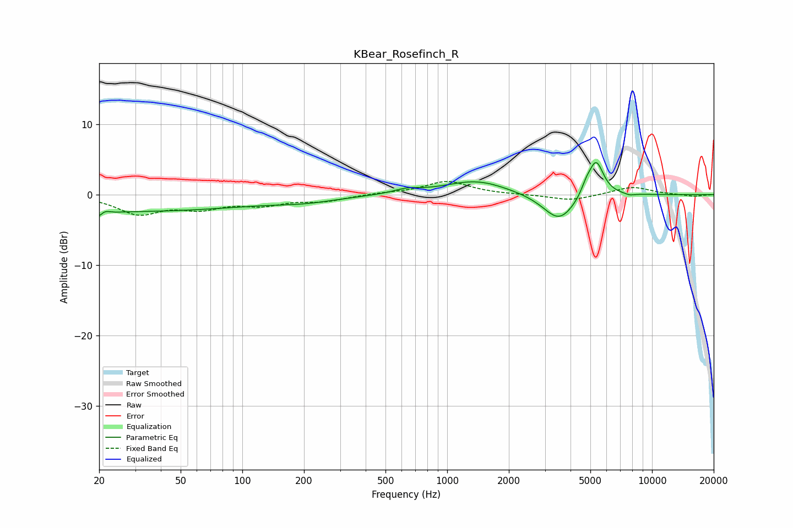

# KBear_Rosefinch_R
See [usage instructions](https://github.com/jaakkopasanen/AutoEq#usage) for more options and info.

### Parametric EQs
Apply preamp of -4.7 dB when using parametric equalizer.

|   # | Type    |   Fc (Hz) |    Q |   Gain (dB) |
|-----|---------|-----------|------|-------------|
|   1 | Peaking |        20 | 3.96 |        -2.3 |
|   2 | Peaking |        21 | 4.96 |         1.9 |
|   3 | Peaking |        29 | 0.23 |        -2.3 |
|   4 | Peaking |       205 | 0.9  |        -0.7 |
|   5 | Peaking |       636 | 2.25 |         0.6 |
|   6 | Peaking |      1385 | 0.93 |         2   |
|   7 | Peaking |      3525 | 1.78 |        -4   |
|   8 | Peaking |      4759 | 5.93 |         1.1 |
|   9 | Peaking |      5327 | 3.7  |         5.2 |
|  10 | Peaking |      7784 | 5.76 |        -0.2 |

### Fixed Band EQs
When using fixed band (also called graphic) equalizer, apply preamp of **-2.0 dB** (if available) and set gains manually with these parameters.

|   # | Type    |   Fc (Hz) |    Q |   Gain (dB) |
|-----|---------|-----------|------|-------------|
|   1 | Peaking |        31 | 1.41 |        -2.6 |
|   2 | Peaking |        62 | 1.41 |        -1.6 |
|   3 | Peaking |       125 | 1.41 |        -1.3 |
|   4 | Peaking |       250 | 1.41 |        -0.8 |
|   5 | Peaking |       500 | 1.41 |         0.2 |
|   6 | Peaking |      1000 | 1.41 |         1.9 |
|   7 | Peaking |      2000 | 1.41 |         0   |
|   8 | Peaking |      4000 | 1.41 |        -0.9 |
|   9 | Peaking |      8000 | 1.41 |         1.1 |
|  10 | Peaking |     16000 | 1.41 |        -0.3 |

### Graphs

