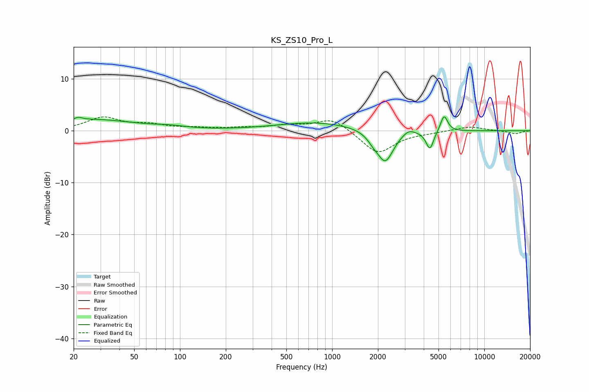

# KS_ZS10_Pro_L
See [usage instructions](https://github.com/jaakkopasanen/AutoEq#usage) for more options and info.

### Parametric EQs
Apply preamp of -2.8 dB when using parametric equalizer.

|   # | Type    |   Fc (Hz) |    Q |   Gain (dB) |
|-----|---------|-----------|------|-------------|
|   1 | Peaking |        22 | 5.88 |         2.4 |
|   2 | Peaking |        22 | 5.96 |        -1.8 |
|   3 | Peaking |        26 | 0.5  |         2.1 |
|   4 | Peaking |        86 | 1.41 |         0.4 |
|   5 | Peaking |       790 | 0.54 |         1.6 |
|   6 | Peaking |      1868 | 3.61 |        -1.1 |
|   7 | Peaking |      2237 | 2.63 |        -6   |
|   8 | Peaking |      3181 | 3.64 |         1   |
|   9 | Peaking |      4389 | 5.7  |        -3.6 |
|  10 | Peaking |      5441 | 5.98 |         3.2 |

### Fixed Band EQs
When using fixed band (also called graphic) equalizer, apply preamp of **-2.8 dB** (if available) and set gains manually with these parameters.

|   # | Type    |   Fc (Hz) |    Q |   Gain (dB) |
|-----|---------|-----------|------|-------------|
|   1 | Peaking |        31 | 1.41 |         2.5 |
|   2 | Peaking |        62 | 1.41 |         1   |
|   3 | Peaking |       125 | 1.41 |         0.4 |
|   4 | Peaking |       250 | 1.41 |         0.4 |
|   5 | Peaking |       500 | 1.41 |         0.9 |
|   6 | Peaking |      1000 | 1.41 |         2.5 |
|   7 | Peaking |      2000 | 1.41 |        -4.5 |
|   8 | Peaking |      4000 | 1.41 |        -0.3 |
|   9 | Peaking |      8000 | 1.41 |         0.8 |
|  10 | Peaking |     16000 | 1.41 |        -0.6 |

### Graphs

