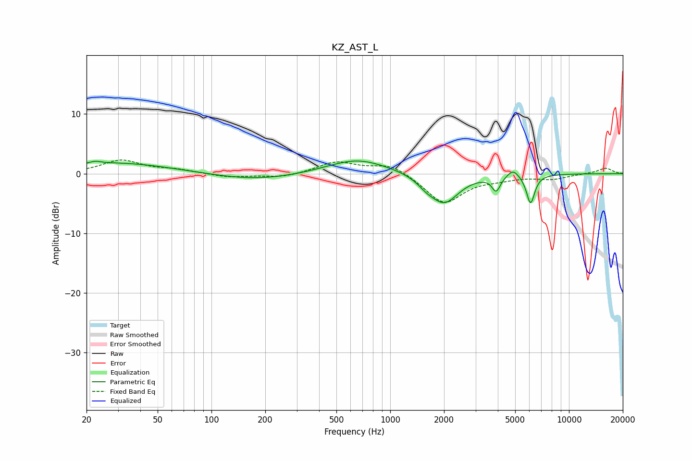

# KZ_AST_L
See [usage instructions](https://github.com/jaakkopasanen/AutoEq#usage) for more options and info.

### Parametric EQs
Apply preamp of -2.2 dB when using parametric equalizer.

|   # | Type    |   Fc (Hz) |    Q |   Gain (dB) |
|-----|---------|-----------|------|-------------|
|   1 | Peaking |        22 | 4.53 |         0.4 |
|   2 | Peaking |        30 | 0.45 |         1.8 |
|   3 | Peaking |       180 | 0.56 |        -1.2 |
|   4 | Peaking |       650 | 1.26 |         0.3 |
|   5 | Peaking |       657 | 0.76 |         2.3 |
|   6 | Peaking |      1594 | 2.88 |        -1   |
|   7 | Peaking |      2006 | 1.73 |        -4.9 |
|   8 | Peaking |      3915 | 6    |        -2.5 |
|   9 | Peaking |      4866 | 4.44 |         1.3 |
|  10 | Peaking |      6098 | 6    |        -4.9 |

### Fixed Band EQs
When using fixed band (also called graphic) equalizer, apply preamp of **-2.4 dB** (if available) and set gains manually with these parameters.

|   # | Type    |   Fc (Hz) |    Q |   Gain (dB) |
|-----|---------|-----------|------|-------------|
|   1 | Peaking |        31 | 1.41 |         2.2 |
|   2 | Peaking |        62 | 1.41 |         0.6 |
|   3 | Peaking |       125 | 1.41 |        -0.6 |
|   4 | Peaking |       250 | 1.41 |        -0.7 |
|   5 | Peaking |       500 | 1.41 |         2   |
|   6 | Peaking |      1000 | 1.41 |         1.7 |
|   7 | Peaking |      2000 | 1.41 |        -5   |
|   8 | Peaking |      4000 | 1.41 |        -0.6 |
|   9 | Peaking |      8000 | 1.41 |        -0.8 |
|  10 | Peaking |     16000 | 1.41 |         1   |

### Graphs

