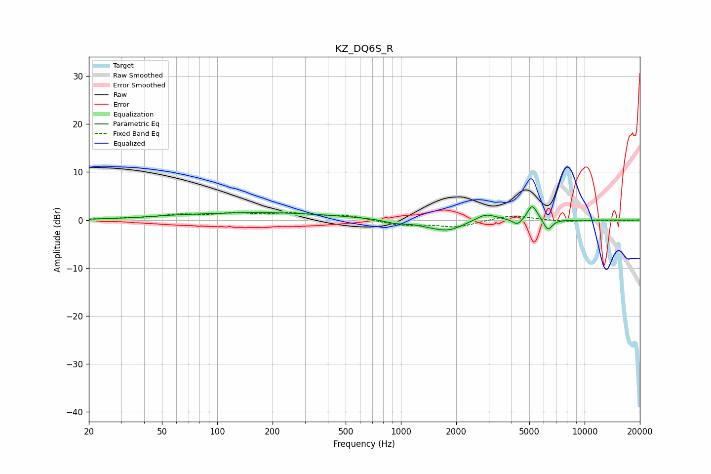

# KZ_DQ6S_R
See [usage instructions](https://github.com/jaakkopasanen/AutoEq#usage) for more options and info.

### Parametric EQs
Apply preamp of -2.9 dB when using parametric equalizer.

|   # | Type    |   Fc (Hz) |    Q |   Gain (dB) |
|-----|---------|-----------|------|-------------|
|   1 | Peaking |        56 | 1.1  |         0.2 |
|   2 | Peaking |       174 | 0.34 |         1.5 |
|   3 | Peaking |       928 | 2.51 |        -0.6 |
|   4 | Peaking |      1725 | 1.24 |        -2.2 |
|   5 | Peaking |      1848 | 3.13 |        -0.3 |
|   6 | Peaking |      2889 | 2.27 |         1.7 |
|   7 | Peaking |      4299 | 5.84 |        -1.2 |
|   8 | Peaking |      5156 | 6    |         2.8 |
|   9 | Peaking |      5477 | 5.85 |         0.7 |
|  10 | Peaking |      6311 | 6    |        -2.3 |

### Fixed Band EQs
When using fixed band (also called graphic) equalizer, apply preamp of **-1.7 dB** (if available) and set gains manually with these parameters.

|   # | Type    |   Fc (Hz) |    Q |   Gain (dB) |
|-----|---------|-----------|------|-------------|
|   1 | Peaking |        31 | 1.41 |         0.2 |
|   2 | Peaking |        62 | 1.41 |         1   |
|   3 | Peaking |       125 | 1.41 |         1.1 |
|   4 | Peaking |       250 | 1.41 |         1.2 |
|   5 | Peaking |       500 | 1.41 |         0.9 |
|   6 | Peaking |      1000 | 1.41 |        -1   |
|   7 | Peaking |      2000 | 1.41 |        -1.4 |
|   8 | Peaking |      4000 | 1.41 |         1.1 |
|   9 | Peaking |      8000 | 1.41 |        -0.3 |
|  10 | Peaking |     16000 | 1.41 |        -0.1 |

### Graphs

