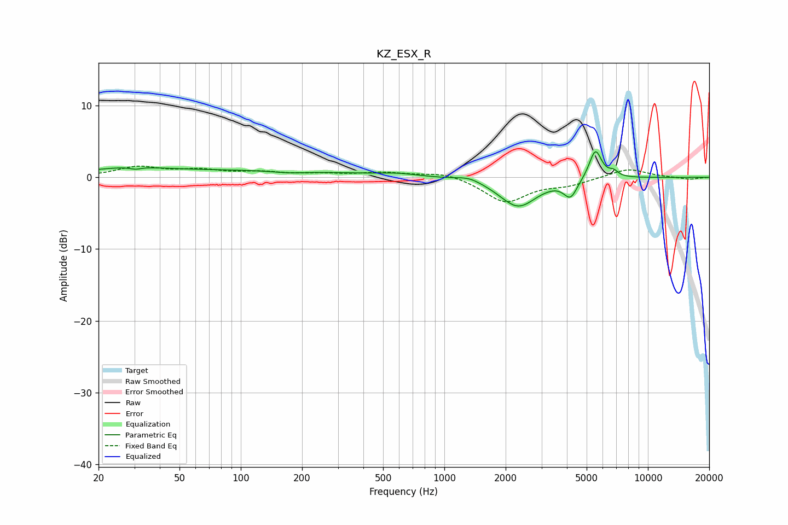

# KZ_ESX_R
See [usage instructions](https://github.com/jaakkopasanen/AutoEq#usage) for more options and info.

### Parametric EQs
Apply preamp of -3.7 dB when using parametric equalizer.

|   # | Type    |   Fc (Hz) |    Q |   Gain (dB) |
|-----|---------|-----------|------|-------------|
|   1 | Peaking |        27 | 0.71 |         1   |
|   2 | Peaking |        30 | 5.6  |        -0.3 |
|   3 | Peaking |       119 | 0.28 |         0.9 |
|   4 | Peaking |       173 | 1.65 |        -0.3 |
|   5 | Peaking |       593 | 1.51 |         0.4 |
|   6 | Peaking |      1321 | 2.4  |         0.6 |
|   7 | Peaking |      2303 | 1.54 |        -4.1 |
|   8 | Peaking |      4166 | 4.26 |        -2.4 |
|   9 | Peaking |      5519 | 4.52 |         4.2 |
|  10 | Peaking |      6777 | 6    |         0.7 |

### Fixed Band EQs
When using fixed band (also called graphic) equalizer, apply preamp of **-1.7 dB** (if available) and set gains manually with these parameters.

|   # | Type    |   Fc (Hz) |    Q |   Gain (dB) |
|-----|---------|-----------|------|-------------|
|   1 | Peaking |        31 | 1.41 |         1.4 |
|   2 | Peaking |        62 | 1.41 |         0.9 |
|   3 | Peaking |       125 | 1.41 |         0.6 |
|   4 | Peaking |       250 | 1.41 |         0.4 |
|   5 | Peaking |       500 | 1.41 |         0.6 |
|   6 | Peaking |      1000 | 1.41 |         0.8 |
|   7 | Peaking |      2000 | 1.41 |        -3.4 |
|   8 | Peaking |      4000 | 1.41 |        -0.9 |
|   9 | Peaking |      8000 | 1.41 |         1.3 |
|  10 | Peaking |     16000 | 1.41 |        -0.3 |

### Graphs

