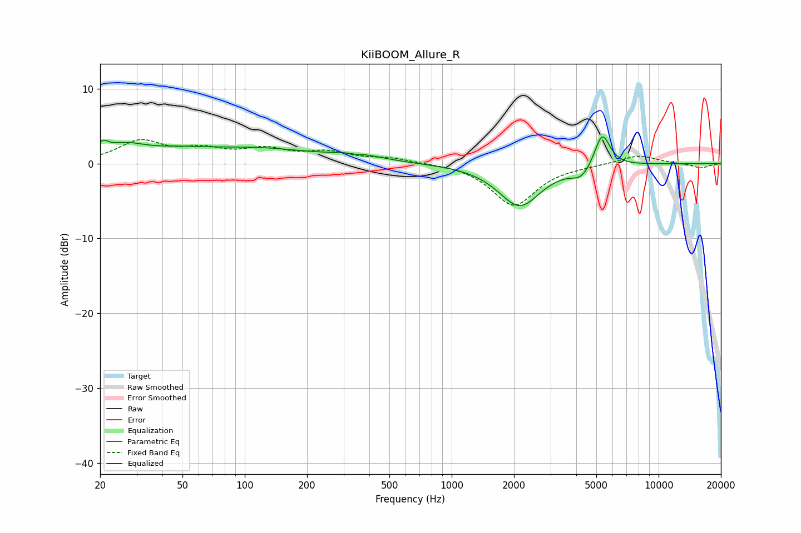

# KiiBOOM_Allure_R
See [usage instructions](https://github.com/jaakkopasanen/AutoEq#usage) for more options and info.

### Parametric EQs
Apply preamp of -3.7 dB when using parametric equalizer.

|   # | Type    |   Fc (Hz) |    Q |   Gain (dB) |
|-----|---------|-----------|------|-------------|
|   1 | Peaking |        21 | 5.47 |         1.2 |
|   2 | Peaking |        26 | 1.31 |         2   |
|   3 | Peaking |        48 | 0.96 |         0.9 |
|   4 | Peaking |       114 | 0.49 |         1.9 |
|   5 | Peaking |       351 | 1.31 |         0.9 |
|   6 | Peaking |       362 | 4.85 |        -2.1 |
|   7 | Peaking |       363 | 5.09 |         1.8 |
|   8 | Peaking |      2130 | 1.38 |        -5.6 |
|   9 | Peaking |      4241 | 2.92 |        -1.6 |
|  10 | Peaking |      5337 | 3.71 |         4.6 |

### Fixed Band EQs
When using fixed band (also called graphic) equalizer, apply preamp of **-3.3 dB** (if available) and set gains manually with these parameters.

|   # | Type    |   Fc (Hz) |    Q |   Gain (dB) |
|-----|---------|-----------|------|-------------|
|   1 | Peaking |        31 | 1.41 |         2.8 |
|   2 | Peaking |        62 | 1.41 |         1.6 |
|   3 | Peaking |       125 | 1.41 |         1.7 |
|   4 | Peaking |       250 | 1.41 |         1.3 |
|   5 | Peaking |       500 | 1.41 |         0.7 |
|   6 | Peaking |      1000 | 1.41 |         0.1 |
|   7 | Peaking |      2000 | 1.41 |        -5.6 |
|   8 | Peaking |      4000 | 1.41 |        -0.2 |
|   9 | Peaking |      8000 | 1.41 |         1.2 |
|  10 | Peaking |     16000 | 1.41 |        -0.6 |

### Graphs

