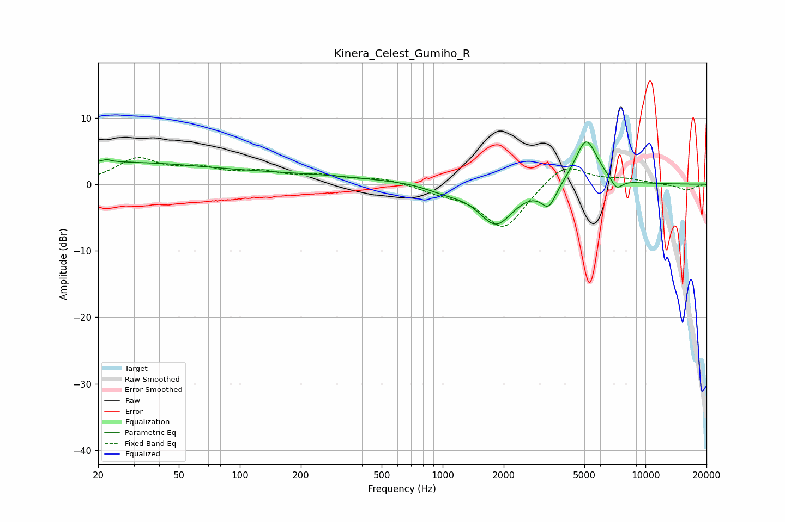

# Kinera_Celest_Gumiho_R
See [usage instructions](https://github.com/jaakkopasanen/AutoEq#usage) for more options and info.

### Parametric EQs
Apply preamp of -6.5 dB when using parametric equalizer.

|   # | Type    |   Fc (Hz) |    Q |   Gain (dB) |
|-----|---------|-----------|------|-------------|
|   1 | Peaking |        22 | 5.86 |         3.2 |
|   2 | Peaking |        22 | 5.91 |        -2.8 |
|   3 | Peaking |        23 | 0.28 |         3.2 |
|   4 | Peaking |       207 | 0.4  |         1.2 |
|   5 | Peaking |       739 | 1.05 |         0.2 |
|   6 | Peaking |      1017 | 1.42 |        -0.9 |
|   7 | Peaking |      1832 | 1.63 |        -6   |
|   8 | Peaking |      3337 | 3.72 |        -3.3 |
|   9 | Peaking |      5104 | 2.47 |         7.1 |
|  10 | Peaking |      7201 | 4.68 |        -1.7 |

### Fixed Band EQs
When using fixed band (also called graphic) equalizer, apply preamp of **-4.1 dB** (if available) and set gains manually with these parameters.

|   # | Type    |   Fc (Hz) |    Q |   Gain (dB) |
|-----|---------|-----------|------|-------------|
|   1 | Peaking |        31 | 1.41 |         3.6 |
|   2 | Peaking |        62 | 1.41 |         1.9 |
|   3 | Peaking |       125 | 1.41 |         1.5 |
|   4 | Peaking |       250 | 1.41 |         1.1 |
|   5 | Peaking |       500 | 1.41 |         0.9 |
|   6 | Peaking |      1000 | 1.41 |        -1   |
|   7 | Peaking |      2000 | 1.41 |        -6.8 |
|   8 | Peaking |      4000 | 1.41 |         3.4 |
|   9 | Peaking |      8000 | 1.41 |         0.7 |
|  10 | Peaking |     16000 | 1.41 |        -0.9 |

### Graphs

