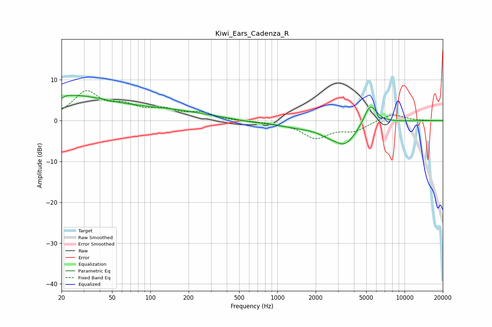

# Kiwi_Ears_Cadenza_R
See [usage instructions](https://github.com/jaakkopasanen/AutoEq#usage) for more options and info.

### Parametric EQs
Apply preamp of -6.3 dB when using parametric equalizer.

|   # | Type    |   Fc (Hz) |    Q |   Gain (dB) |
|-----|---------|-----------|------|-------------|
|   1 | Peaking |        20 | 0.35 |         6.2 |
|   2 | Peaking |        20 | 5.88 |        -4.3 |
|   3 | Peaking |        20 | 5.9  |         3.3 |
|   4 | Peaking |       148 | 0.47 |         2   |
|   5 | Peaking |       426 | 1.3  |         0.3 |
|   6 | Peaking |       509 | 0.83 |        -0.6 |
|   7 | Peaking |      1527 | 0.76 |        -1.3 |
|   8 | Peaking |      2452 | 2.17 |        -0.8 |
|   9 | Peaking |      3394 | 1.43 |        -5.5 |
|  10 | Peaking |      5377 | 2.7  |         5.3 |

### Fixed Band EQs
When using fixed band (also called graphic) equalizer, apply preamp of **-7.4 dB** (if available) and set gains manually with these parameters.

|   # | Type    |   Fc (Hz) |    Q |   Gain (dB) |
|-----|---------|-----------|------|-------------|
|   1 | Peaking |        31 | 1.41 |         6.7 |
|   2 | Peaking |        62 | 1.41 |         2.8 |
|   3 | Peaking |       125 | 1.41 |         2.3 |
|   4 | Peaking |       250 | 1.41 |         1.7 |
|   5 | Peaking |       500 | 1.41 |        -0.1 |
|   6 | Peaking |      1000 | 1.41 |        -0.4 |
|   7 | Peaking |      2000 | 1.41 |        -4   |
|   8 | Peaking |      4000 | 1.41 |        -2.2 |
|   9 | Peaking |      8000 | 1.41 |         1.8 |
|  10 | Peaking |     16000 | 1.41 |        -0   |

### Graphs

