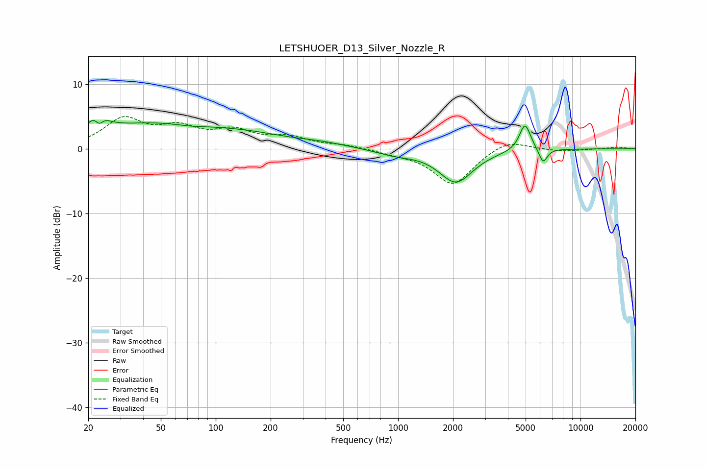

# LETSHUOER_D13_Silver_Nozzle_R
See [usage instructions](https://github.com/jaakkopasanen/AutoEq#usage) for more options and info.

### Parametric EQs
Apply preamp of -4.5 dB when using parametric equalizer.

|   # | Type    |   Fc (Hz) |    Q |   Gain (dB) |
|-----|---------|-----------|------|-------------|
|   1 | Peaking |        23 | 3.36 |         3.7 |
|   2 | Peaking |        23 | 5.86 |        -2.6 |
|   3 | Peaking |        45 | 0.39 |         3.8 |
|   4 | Peaking |        71 | 1.63 |        -0.3 |
|   5 | Peaking |       161 | 0.66 |         1.2 |
|   6 | Peaking |       379 | 1    |         0.6 |
|   7 | Peaking |       962 | 1.3  |        -0.8 |
|   8 | Peaking |      2076 | 1.51 |        -5.1 |
|   9 | Peaking |      4964 | 4.51 |         4.3 |
|  10 | Peaking |      6236 | 6    |        -2.3 |

### Fixed Band EQs
When using fixed band (also called graphic) equalizer, apply preamp of **-5.1 dB** (if available) and set gains manually with these parameters.

|   # | Type    |   Fc (Hz) |    Q |   Gain (dB) |
|-----|---------|-----------|------|-------------|
|   1 | Peaking |        31 | 1.41 |         4.4 |
|   2 | Peaking |        62 | 1.41 |         2.7 |
|   3 | Peaking |       125 | 1.41 |         2.4 |
|   4 | Peaking |       250 | 1.41 |         1.6 |
|   5 | Peaking |       500 | 1.41 |         0.5 |
|   6 | Peaking |      1000 | 1.41 |        -0.5 |
|   7 | Peaking |      2000 | 1.41 |        -5.5 |
|   8 | Peaking |      4000 | 1.41 |         1.6 |
|   9 | Peaking |      8000 | 1.41 |        -0.4 |
|  10 | Peaking |     16000 | 1.41 |         0.3 |

### Graphs

