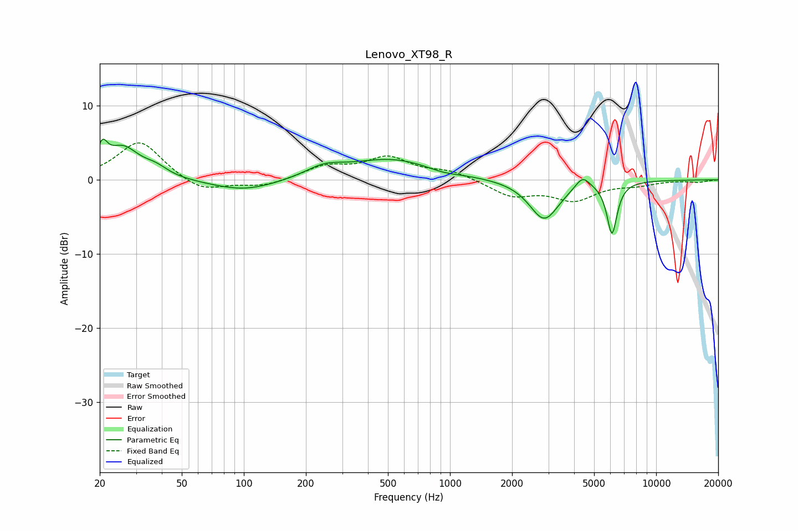

# Lenovo_XT98_R
See [usage instructions](https://github.com/jaakkopasanen/AutoEq#usage) for more options and info.

### Parametric EQs
Apply preamp of -5.6 dB when using parametric equalizer.

|   # | Type    |   Fc (Hz) |    Q |   Gain (dB) |
|-----|---------|-----------|------|-------------|
|   1 | Peaking |        21 | 5.93 |         2.9 |
|   2 | Peaking |        26 | 1.76 |         4.2 |
|   3 | Peaking |        37 | 2.44 |         1.1 |
|   4 | Peaking |       101 | 0.88 |        -1.6 |
|   5 | Peaking |       246 | 1.59 |         1.3 |
|   6 | Peaking |       521 | 0.67 |         2.8 |
|   7 | Peaking |       925 | 1.84 |        -0.5 |
|   8 | Peaking |      2866 | 1.96 |        -5.4 |
|   9 | Peaking |      4395 | 4    |         1.7 |
|  10 | Peaking |      6106 | 5.55 |        -7   |

### Fixed Band EQs
When using fixed band (also called graphic) equalizer, apply preamp of **-5.1 dB** (if available) and set gains manually with these parameters.

|   # | Type    |   Fc (Hz) |    Q |   Gain (dB) |
|-----|---------|-----------|------|-------------|
|   1 | Peaking |        31 | 1.41 |         5.3 |
|   2 | Peaking |        62 | 1.41 |        -1.8 |
|   3 | Peaking |       125 | 1.41 |        -0.9 |
|   4 | Peaking |       250 | 1.41 |         1.7 |
|   5 | Peaking |       500 | 1.41 |         2.8 |
|   6 | Peaking |      1000 | 1.41 |         1.1 |
|   7 | Peaking |      2000 | 1.41 |        -2.1 |
|   8 | Peaking |      4000 | 1.41 |        -2.6 |
|   9 | Peaking |      8000 | 1.41 |        -0.6 |
|  10 | Peaking |     16000 | 1.41 |        -0.3 |

### Graphs

