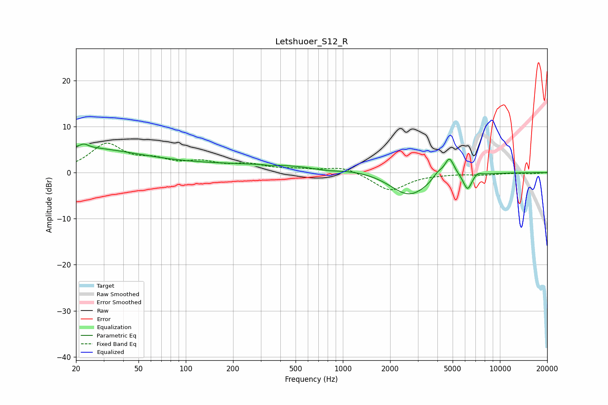

# Letshuoer_S12_R
See [usage instructions](https://github.com/jaakkopasanen/AutoEq#usage) for more options and info.

### Parametric EQs
Apply preamp of -6.3 dB when using parametric equalizer.

|   # | Type    |   Fc (Hz) |    Q |   Gain (dB) |
|-----|---------|-----------|------|-------------|
|   1 | Peaking |        20 | 0.34 |         5.3 |
|   2 | Peaking |        22 | 5.38 |         0.8 |
|   3 | Peaking |       348 | 5.97 |        -0.2 |
|   4 | Peaking |       401 | 0.18 |         1.7 |
|   5 | Peaking |       795 | 1.37 |        -0.7 |
|   6 | Peaking |      2640 | 1.12 |        -5.5 |
|   7 | Peaking |      4017 | 4.02 |         1.5 |
|   8 | Peaking |      4770 | 4.48 |         4.2 |
|   9 | Peaking |      6223 | 5.26 |        -3.5 |
|  10 | Peaking |      7231 | 5.9  |         0.7 |

### Fixed Band EQs
When using fixed band (also called graphic) equalizer, apply preamp of **-6.5 dB** (if available) and set gains manually with these parameters.

|   # | Type    |   Fc (Hz) |    Q |   Gain (dB) |
|-----|---------|-----------|------|-------------|
|   1 | Peaking |        31 | 1.41 |         5.9 |
|   2 | Peaking |        62 | 1.41 |         2.1 |
|   3 | Peaking |       125 | 1.41 |         1.9 |
|   4 | Peaking |       250 | 1.41 |         1.5 |
|   5 | Peaking |       500 | 1.41 |         0.5 |
|   6 | Peaking |      1000 | 1.41 |         1.3 |
|   7 | Peaking |      2000 | 1.41 |        -3.9 |
|   8 | Peaking |      4000 | 1.41 |        -0.2 |
|   9 | Peaking |      8000 | 1.41 |        -0.4 |
|  10 | Peaking |     16000 | 1.41 |        -0.2 |

### Graphs

