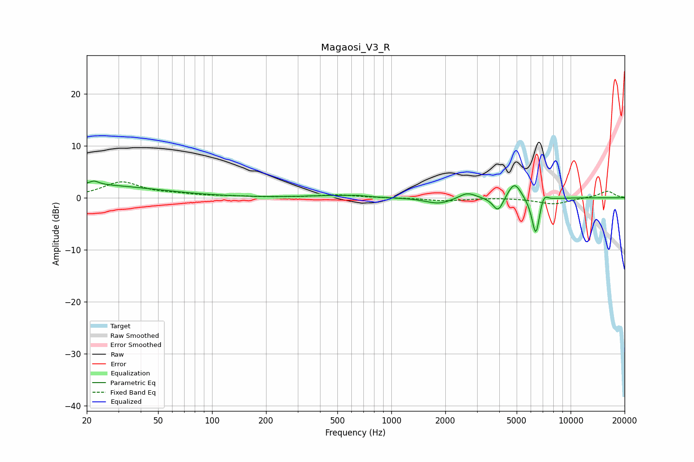

# Magaosi_V3_R
See [usage instructions](https://github.com/jaakkopasanen/AutoEq#usage) for more options and info.

### Parametric EQs
Apply preamp of -3.3 dB when using parametric equalizer.

|   # | Type    |   Fc (Hz) |    Q |   Gain (dB) |
|-----|---------|-----------|------|-------------|
|   1 | Peaking |        20 | 0.36 |         2.5 |
|   2 | Peaking |        22 | 5.34 |         0.7 |
|   3 | Peaking |       446 | 1.12 |         0.4 |
|   4 | Peaking |       641 | 2.42 |         0.3 |
|   5 | Peaking |      1840 | 1.94 |        -1.2 |
|   6 | Peaking |      2655 | 3.1  |         1.2 |
|   7 | Peaking |      3942 | 4.87 |        -2.9 |
|   8 | Peaking |      4859 | 3.7  |         3.3 |
|   9 | Peaking |      6398 | 6    |        -7.7 |
|  10 | Peaking |      7049 | 5.84 |         2.1 |

### Fixed Band EQs
When using fixed band (also called graphic) equalizer, apply preamp of **-3.2 dB** (if available) and set gains manually with these parameters.

|   # | Type    |   Fc (Hz) |    Q |   Gain (dB) |
|-----|---------|-----------|------|-------------|
|   1 | Peaking |        31 | 1.41 |         2.9 |
|   2 | Peaking |        62 | 1.41 |         0.5 |
|   3 | Peaking |       125 | 1.41 |         0.2 |
|   4 | Peaking |       250 | 1.41 |         0.1 |
|   5 | Peaking |       500 | 1.41 |         0.5 |
|   6 | Peaking |      1000 | 1.41 |        -0   |
|   7 | Peaking |      2000 | 1.41 |        -0.6 |
|   8 | Peaking |      4000 | 1.41 |         0.1 |
|   9 | Peaking |      8000 | 1.41 |        -1.2 |
|  10 | Peaking |     16000 | 1.41 |         1.3 |

### Graphs

