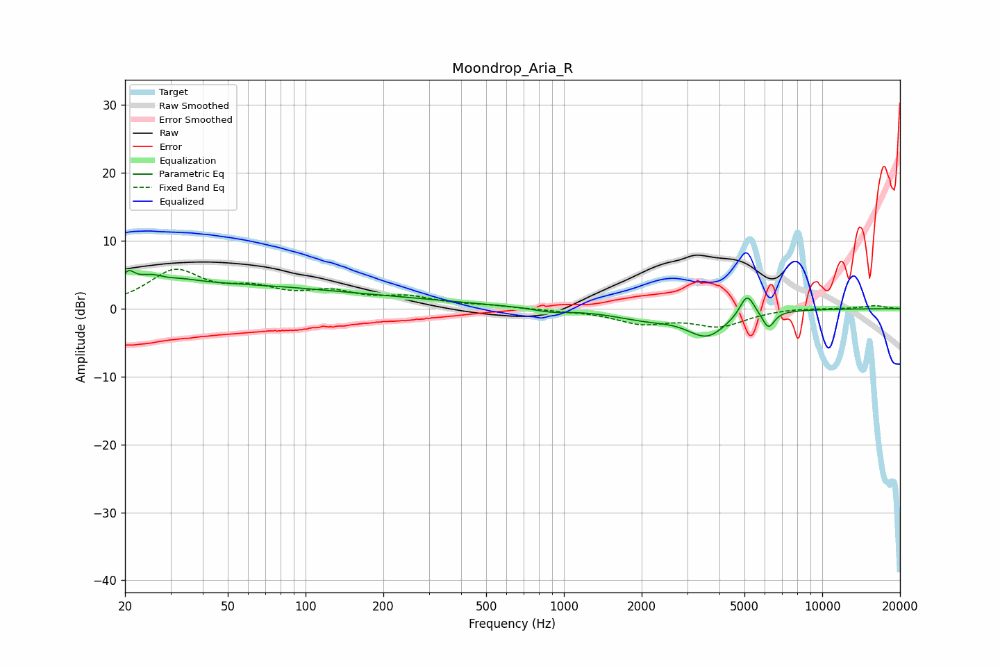

# Moondrop_Aria_R
See [usage instructions](https://github.com/jaakkopasanen/AutoEq#usage) for more options and info.

### Parametric EQs
Apply preamp of -5.7 dB when using parametric equalizer.

|   # | Type    |   Fc (Hz) |    Q |   Gain (dB) |
|-----|---------|-----------|------|-------------|
|   1 | Peaking |        21 | 6    |         2.1 |
|   2 | Peaking |        27 | 1.64 |         4   |
|   3 | Peaking |        29 | 2.61 |        -1.8 |
|   4 | Peaking |        50 | 0.4  |         2.9 |
|   5 | Peaking |       207 | 0.43 |         1.1 |
|   6 | Peaking |       889 | 2.15 |        -0.5 |
|   7 | Peaking |      2072 | 1.1  |        -1.3 |
|   8 | Peaking |      3578 | 1.82 |        -3.7 |
|   9 | Peaking |      5115 | 5.01 |         3.3 |
|  10 | Peaking |      6189 | 6    |        -2.5 |

### Fixed Band EQs
When using fixed band (also called graphic) equalizer, apply preamp of **-5.9 dB** (if available) and set gains manually with these parameters.

|   # | Type    |   Fc (Hz) |    Q |   Gain (dB) |
|-----|---------|-----------|------|-------------|
|   1 | Peaking |        31 | 1.41 |         5.3 |
|   2 | Peaking |        62 | 1.41 |         2.3 |
|   3 | Peaking |       125 | 1.41 |         2   |
|   4 | Peaking |       250 | 1.41 |         1.4 |
|   5 | Peaking |       500 | 1.41 |         0.4 |
|   6 | Peaking |      1000 | 1.41 |        -0.2 |
|   7 | Peaking |      2000 | 1.41 |        -2   |
|   8 | Peaking |      4000 | 1.41 |        -2.4 |
|   9 | Peaking |      8000 | 1.41 |         0.2 |
|  10 | Peaking |     16000 | 1.41 |         0.5 |

### Graphs

