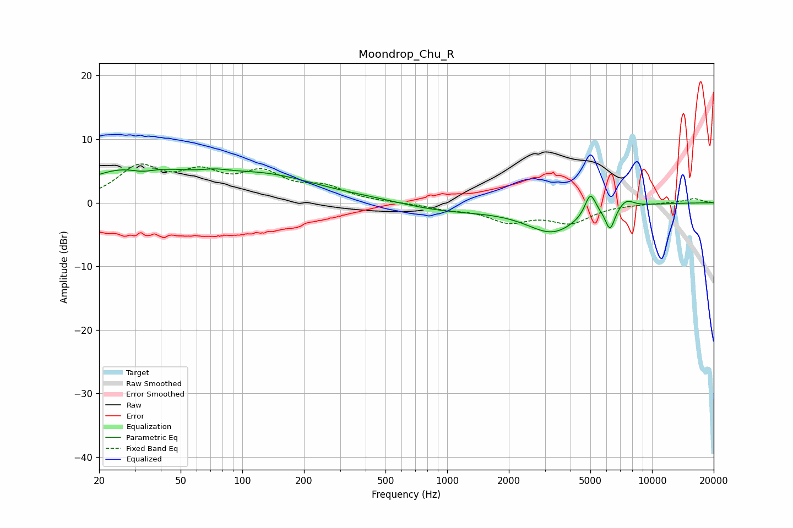

# Moondrop_Chu_R
See [usage instructions](https://github.com/jaakkopasanen/AutoEq#usage) for more options and info.

### Parametric EQs
Apply preamp of -5.4 dB when using parametric equalizer.

|   # | Type    |   Fc (Hz) |    Q |   Gain (dB) |
|-----|---------|-----------|------|-------------|
|   1 | Peaking |        29 | 0.6  |         5.3 |
|   2 | Peaking |        33 | 2.05 |        -1.2 |
|   3 | Peaking |        73 | 2.26 |         0.5 |
|   4 | Peaking |       129 | 0.51 |         3.9 |
|   5 | Peaking |       463 | 0.84 |         0.5 |
|   6 | Peaking |       975 | 0.52 |        -1.3 |
|   7 | Peaking |      3276 | 1.08 |        -4.4 |
|   8 | Peaking |      5000 | 5.23 |         3.6 |
|   9 | Peaking |      6240 | 5.98 |        -3.5 |
|  10 | Peaking |      7481 | 3.66 |         1.3 |

### Fixed Band EQs
When using fixed band (also called graphic) equalizer, apply preamp of **-6.2 dB** (if available) and set gains manually with these parameters.

|   # | Type    |   Fc (Hz) |    Q |   Gain (dB) |
|-----|---------|-----------|------|-------------|
|   1 | Peaking |        31 | 1.41 |         5.2 |
|   2 | Peaking |        62 | 1.41 |         3.9 |
|   3 | Peaking |       125 | 1.41 |         4.1 |
|   4 | Peaking |       250 | 1.41 |         2.1 |
|   5 | Peaking |       500 | 1.41 |        -0   |
|   6 | Peaking |      1000 | 1.41 |        -0.8 |
|   7 | Peaking |      2000 | 1.41 |        -2.7 |
|   8 | Peaking |      4000 | 1.41 |        -2.9 |
|   9 | Peaking |      8000 | 1.41 |        -0.1 |
|  10 | Peaking |     16000 | 1.41 |         0.7 |

### Graphs

