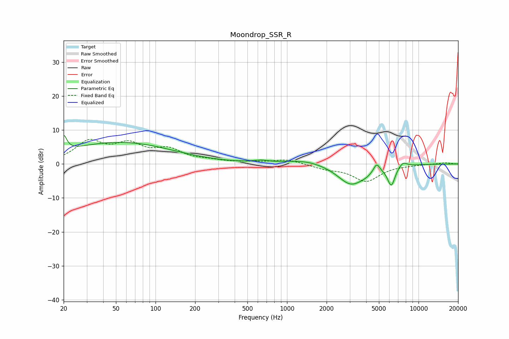

# Moondrop_SSR_R
See [usage instructions](https://github.com/jaakkopasanen/AutoEq#usage) for more options and info.

### Parametric EQs
Apply preamp of -8.5 dB when using parametric equalizer.

|   # | Type    |   Fc (Hz) |    Q |   Gain (dB) |
|-----|---------|-----------|------|-------------|
|   1 | Peaking |        20 | 6    |         4.6 |
|   2 | Peaking |        50 | 0.35 |         1.7 |
|   3 | Peaking |        55 | 0.35 |         4.6 |
|   4 | Peaking |       638 | 2.65 |         0.6 |
|   5 | Peaking |      1396 | 0.96 |         1.3 |
|   6 | Peaking |      3055 | 1.39 |        -6   |
|   7 | Peaking |      3953 | 2.72 |        -0.8 |
|   8 | Peaking |      4803 | 6    |         2.6 |
|   9 | Peaking |      6208 | 4.79 |        -5.7 |
|  10 | Peaking |      7603 | 4.26 |         1.5 |

### Fixed Band EQs
When using fixed band (also called graphic) equalizer, apply preamp of **-7.3 dB** (if available) and set gains manually with these parameters.

|   # | Type    |   Fc (Hz) |    Q |   Gain (dB) |
|-----|---------|-----------|------|-------------|
|   1 | Peaking |        31 | 1.41 |         6.1 |
|   2 | Peaking |        62 | 1.41 |         4.9 |
|   3 | Peaking |       125 | 1.41 |         3.7 |
|   4 | Peaking |       250 | 1.41 |         0.8 |
|   5 | Peaking |       500 | 1.41 |         0.4 |
|   6 | Peaking |      1000 | 1.41 |         1.3 |
|   7 | Peaking |      2000 | 1.41 |        -1.2 |
|   8 | Peaking |      4000 | 1.41 |        -5   |
|   9 | Peaking |      8000 | 1.41 |        -0.2 |
|  10 | Peaking |     16000 | 1.41 |         0.4 |

### Graphs

