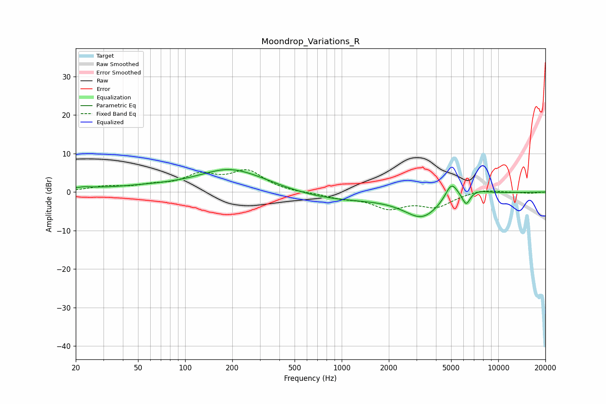

# Moondrop_Variations_R
See [usage instructions](https://github.com/jaakkopasanen/AutoEq#usage) for more options and info.

### Parametric EQs
Apply preamp of -5.9 dB when using parametric equalizer.

|   # | Type    |   Fc (Hz) |    Q |   Gain (dB) |
|-----|---------|-----------|------|-------------|
|   1 | Peaking |        22 | 0.52 |         0.7 |
|   2 | Peaking |        23 | 4.11 |         0.3 |
|   3 | Peaking |        55 | 0.89 |         0.5 |
|   4 | Peaking |       182 | 1.24 |         0.6 |
|   5 | Peaking |       207 | 0.56 |         5.8 |
|   6 | Peaking |       846 | 0.39 |        -2.3 |
|   7 | Peaking |      3265 | 1.19 |        -6.1 |
|   8 | Peaking |      5020 | 3.46 |         4.6 |
|   9 | Peaking |      6238 | 5.64 |        -3.2 |
|  10 | Peaking |      7356 | 1.94 |         1.1 |

### Fixed Band EQs
When using fixed band (also called graphic) equalizer, apply preamp of **-5.9 dB** (if available) and set gains manually with these parameters.

|   # | Type    |   Fc (Hz) |    Q |   Gain (dB) |
|-----|---------|-----------|------|-------------|
|   1 | Peaking |        31 | 1.41 |         1.2 |
|   2 | Peaking |        62 | 1.41 |         1.3 |
|   3 | Peaking |       125 | 1.41 |         3.9 |
|   4 | Peaking |       250 | 1.41 |         5.1 |
|   5 | Peaking |       500 | 1.41 |        -0.2 |
|   6 | Peaking |      1000 | 1.41 |        -1.3 |
|   7 | Peaking |      2000 | 1.41 |        -3.8 |
|   8 | Peaking |      4000 | 1.41 |        -3.5 |
|   9 | Peaking |      8000 | 1.41 |         0.8 |
|  10 | Peaking |     16000 | 1.41 |        -0.3 |

### Graphs

