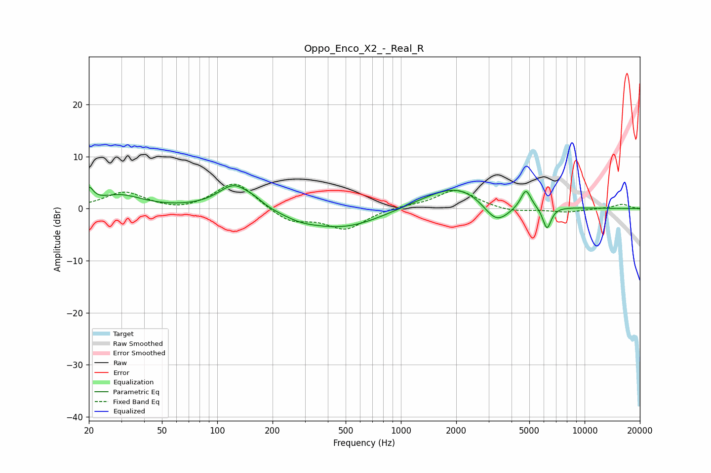

# Oppo_Enco_X2_-_Real_R
See [usage instructions](https://github.com/jaakkopasanen/AutoEq#usage) for more options and info.

### Parametric EQs
Apply preamp of -4.5 dB when using parametric equalizer.

|   # | Type    |   Fc (Hz) |    Q |   Gain (dB) |
|-----|---------|-----------|------|-------------|
|   1 | Peaking |        20 | 6    |         2.8 |
|   2 | Peaking |        29 | 1.2  |         2.5 |
|   3 | Peaking |       124 | 1.6  |         4.7 |
|   4 | Peaking |       160 | 3.23 |         0.7 |
|   5 | Peaking |       284 | 1.51 |        -0.9 |
|   6 | Peaking |       489 | 0.65 |        -3.8 |
|   7 | Peaking |      2068 | 0.73 |         5   |
|   8 | Peaking |      3306 | 1.83 |        -4.9 |
|   9 | Peaking |      4789 | 5.12 |         3.6 |
|  10 | Peaking |      6239 | 5.99 |        -4.3 |

### Fixed Band EQs
When using fixed band (also called graphic) equalizer, apply preamp of **-4.8 dB** (if available) and set gains manually with these parameters.

|   # | Type    |   Fc (Hz) |    Q |   Gain (dB) |
|-----|---------|-----------|------|-------------|
|   1 | Peaking |        31 | 1.41 |         3.1 |
|   2 | Peaking |        62 | 1.41 |        -0.7 |
|   3 | Peaking |       125 | 1.41 |         5.3 |
|   4 | Peaking |       250 | 1.41 |        -2.6 |
|   5 | Peaking |       500 | 1.41 |        -3.8 |
|   6 | Peaking |      1000 | 1.41 |         0.5 |
|   7 | Peaking |      2000 | 1.41 |         3.7 |
|   8 | Peaking |      4000 | 1.41 |        -0.7 |
|   9 | Peaking |      8000 | 1.41 |        -0.7 |
|  10 | Peaking |     16000 | 1.41 |         0.8 |

### Graphs

