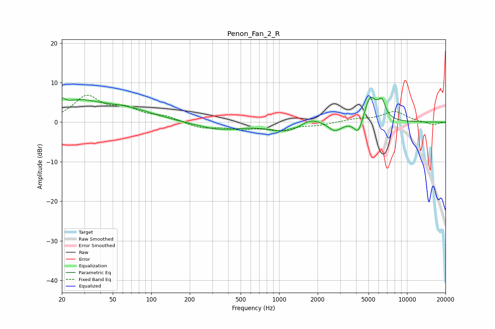

# Penon_Fan_2_R
See [usage instructions](https://github.com/jaakkopasanen/AutoEq#usage) for more options and info.

### Parametric EQs
Apply preamp of -6.4 dB when using parametric equalizer.

|   # | Type    |   Fc (Hz) |    Q |   Gain (dB) |
|-----|---------|-----------|------|-------------|
|   1 | Peaking |        20 | 6    |         1.9 |
|   2 | Peaking |        26 | 0.86 |         4.3 |
|   3 | Peaking |        61 | 0.63 |         3.1 |
|   4 | Peaking |       338 | 0.79 |        -1.8 |
|   5 | Peaking |      1218 | 1.01 |        -2.8 |
|   6 | Peaking |      1740 | 1.47 |         2.3 |
|   7 | Peaking |      2736 | 2.66 |        -2.4 |
|   8 | Peaking |      4171 | 4.07 |        -4   |
|   9 | Peaking |      5154 | 2.96 |         6.5 |
|  10 | Peaking |      6348 | 4.69 |         4.1 |

### Fixed Band EQs
When using fixed band (also called graphic) equalizer, apply preamp of **-6.9 dB** (if available) and set gains manually with these parameters.

|   # | Type    |   Fc (Hz) |    Q |   Gain (dB) |
|-----|---------|-----------|------|-------------|
|   1 | Peaking |        31 | 1.41 |         6.2 |
|   2 | Peaking |        62 | 1.41 |         2.9 |
|   3 | Peaking |       125 | 1.41 |         1.3 |
|   4 | Peaking |       250 | 1.41 |        -1.5 |
|   5 | Peaking |       500 | 1.41 |        -1.4 |
|   6 | Peaking |      1000 | 1.41 |        -1.8 |
|   7 | Peaking |      2000 | 1.41 |        -0.7 |
|   8 | Peaking |      4000 | 1.41 |         0.7 |
|   9 | Peaking |      8000 | 1.41 |         2.6 |
|  10 | Peaking |     16000 | 1.41 |        -0.7 |

### Graphs

