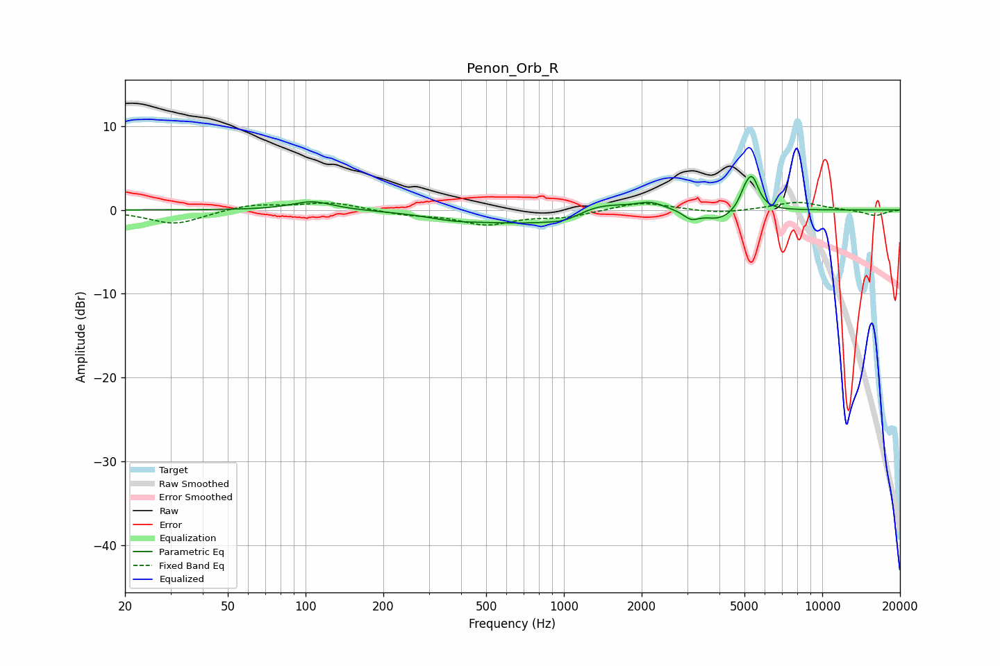

# Penon_Orb_R
See [usage instructions](https://github.com/jaakkopasanen/AutoEq#usage) for more options and info.

### Parametric EQs
Apply preamp of -4.1 dB when using parametric equalizer.

|   # | Type    |   Fc (Hz) |    Q |   Gain (dB) |
|-----|---------|-----------|------|-------------|
|   1 | Peaking |       106 | 1.78 |         1.1 |
|   2 | Peaking |       374 | 1.32 |        -0.6 |
|   3 | Peaking |       755 | 0.67 |        -1.6 |
|   4 | Peaking |      1016 | 2.26 |        -0.7 |
|   5 | Peaking |      1361 | 1.17 |         1.5 |
|   6 | Peaking |      2172 | 2.65 |         0.9 |
|   7 | Peaking |      3110 | 4.7  |        -1   |
|   8 | Peaking |      4015 | 2.31 |        -1.2 |
|   9 | Peaking |      5025 | 5.95 |         1.4 |
|  10 | Peaking |      5362 | 5.41 |         3.5 |

### Fixed Band EQs
When using fixed band (also called graphic) equalizer, apply preamp of **-1.0 dB** (if available) and set gains manually with these parameters.

|   # | Type    |   Fc (Hz) |    Q |   Gain (dB) |
|-----|---------|-----------|------|-------------|
|   1 | Peaking |        31 | 1.41 |        -1.7 |
|   2 | Peaking |        62 | 1.41 |         0.7 |
|   3 | Peaking |       125 | 1.41 |         0.9 |
|   4 | Peaking |       250 | 1.41 |        -0.5 |
|   5 | Peaking |       500 | 1.41 |        -1.6 |
|   6 | Peaking |      1000 | 1.41 |        -0.8 |
|   7 | Peaking |      2000 | 1.41 |         1   |
|   8 | Peaking |      4000 | 1.41 |        -0.4 |
|   9 | Peaking |      8000 | 1.41 |         1   |
|  10 | Peaking |     16000 | 1.41 |        -0.7 |

### Graphs

