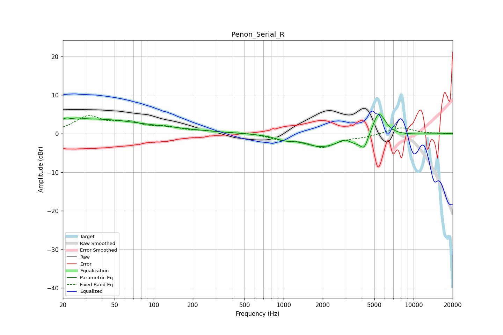

# Penon_Serial_R
See [usage instructions](https://github.com/jaakkopasanen/AutoEq#usage) for more options and info.

### Parametric EQs
Apply preamp of -5.1 dB when using parametric equalizer.

|   # | Type    |   Fc (Hz) |    Q |   Gain (dB) |
|-----|---------|-----------|------|-------------|
|   1 | Peaking |        23 | 2.89 |         3.8 |
|   2 | Peaking |        23 | 4.23 |        -2.6 |
|   3 | Peaking |        39 | 0.48 |         3.3 |
|   4 | Peaking |       137 | 0.55 |         0.8 |
|   5 | Peaking |      1014 | 2.04 |        -1   |
|   6 | Peaking |      1867 | 1.16 |        -2.5 |
|   7 | Peaking |      2955 | 2.85 |         1.7 |
|   8 | Peaking |      3810 | 0.91 |        -3.5 |
|   9 | Peaking |      4172 | 5.1  |        -2.5 |
|  10 | Peaking |      5386 | 2.46 |         7.7 |

### Fixed Band EQs
When using fixed band (also called graphic) equalizer, apply preamp of **-4.7 dB** (if available) and set gains manually with these parameters.

|   # | Type    |   Fc (Hz) |    Q |   Gain (dB) |
|-----|---------|-----------|------|-------------|
|   1 | Peaking |        31 | 1.41 |         4.1 |
|   2 | Peaking |        62 | 1.41 |         2.5 |
|   3 | Peaking |       125 | 1.41 |         1.4 |
|   4 | Peaking |       250 | 1.41 |         0.5 |
|   5 | Peaking |       500 | 1.41 |         0.2 |
|   6 | Peaking |      1000 | 1.41 |        -1.4 |
|   7 | Peaking |      2000 | 1.41 |        -3.3 |
|   8 | Peaking |      4000 | 1.41 |        -0.7 |
|   9 | Peaking |      8000 | 1.41 |         1.7 |
|  10 | Peaking |     16000 | 1.41 |         0.1 |

### Graphs

