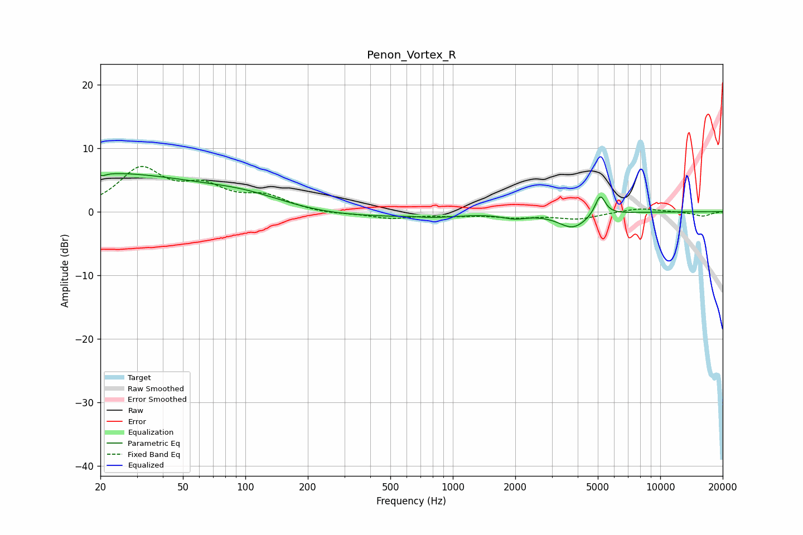

# Penon_Vortex_R
See [usage instructions](https://github.com/jaakkopasanen/AutoEq#usage) for more options and info.

### Parametric EQs
Apply preamp of -6.1 dB when using parametric equalizer.

|   # | Type    |   Fc (Hz) |    Q |   Gain (dB) |
|-----|---------|-----------|------|-------------|
|   1 | Peaking |        20 | 5.76 |         3.3 |
|   2 | Peaking |        20 | 0.27 |         6   |
|   3 | Peaking |        20 | 5.91 |        -3.7 |
|   4 | Peaking |       102 | 0.72 |         1.6 |
|   5 | Peaking |       265 | 0.59 |        -0.8 |
|   6 | Peaking |       636 | 1.9  |         0.4 |
|   7 | Peaking |       713 | 0.97 |        -1   |
|   8 | Peaking |      1982 | 2.33 |        -0.8 |
|   9 | Peaking |      3795 | 2    |        -2.5 |
|  10 | Peaking |      5137 | 5.63 |         3.3 |

### Fixed Band EQs
When using fixed band (also called graphic) equalizer, apply preamp of **-7.2 dB** (if available) and set gains manually with these parameters.

|   # | Type    |   Fc (Hz) |    Q |   Gain (dB) |
|-----|---------|-----------|------|-------------|
|   1 | Peaking |        31 | 1.41 |         6.4 |
|   2 | Peaking |        62 | 1.41 |         3.3 |
|   3 | Peaking |       125 | 1.41 |         2.1 |
|   4 | Peaking |       250 | 1.41 |        -0.4 |
|   5 | Peaking |       500 | 1.41 |        -1   |
|   6 | Peaking |      1000 | 1.41 |        -0.5 |
|   7 | Peaking |      2000 | 1.41 |        -0.8 |
|   8 | Peaking |      4000 | 1.41 |        -1.1 |
|   9 | Peaking |      8000 | 1.41 |         0.6 |
|  10 | Peaking |     16000 | 1.41 |        -0.7 |

### Graphs

