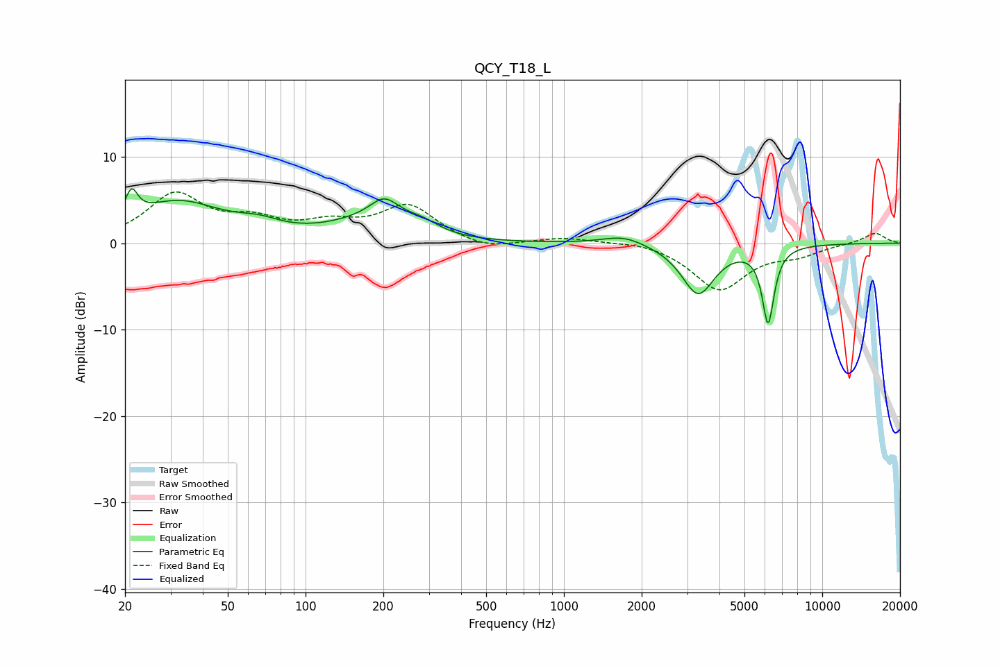

# QCY_T18_L
See [usage instructions](https://github.com/jaakkopasanen/AutoEq#usage) for more options and info.

### Parametric EQs
Apply preamp of -6.4 dB when using parametric equalizer.

|   # | Type    |   Fc (Hz) |    Q |   Gain (dB) |
|-----|---------|-----------|------|-------------|
|   1 | Peaking |        21 | 5.92 |         3.1 |
|   2 | Peaking |        32 | 0.82 |         4.6 |
|   3 | Peaking |        66 | 1.62 |         1.1 |
|   4 | Peaking |       152 | 0.96 |         1.4 |
|   5 | Peaking |       195 | 2.38 |        -1.8 |
|   6 | Peaking |       199 | 2.22 |         5.1 |
|   7 | Peaking |       282 | 1.97 |         1.4 |
|   8 | Peaking |      1703 | 1.72 |         1.1 |
|   9 | Peaking |      3310 | 2.2  |        -5.9 |
|  10 | Peaking |      6174 | 6    |        -8.8 |

### Fixed Band EQs
When using fixed band (also called graphic) equalizer, apply preamp of **-6.0 dB** (if available) and set gains manually with these parameters.

|   # | Type    |   Fc (Hz) |    Q |   Gain (dB) |
|-----|---------|-----------|------|-------------|
|   1 | Peaking |        31 | 1.41 |         5.4 |
|   2 | Peaking |        62 | 1.41 |         2.1 |
|   3 | Peaking |       125 | 1.41 |         1.8 |
|   4 | Peaking |       250 | 1.41 |         4.2 |
|   5 | Peaking |       500 | 1.41 |        -0.9 |
|   6 | Peaking |      1000 | 1.41 |         0.6 |
|   7 | Peaking |      2000 | 1.41 |         0.4 |
|   8 | Peaking |      4000 | 1.41 |        -5.3 |
|   9 | Peaking |      8000 | 1.41 |        -1.1 |
|  10 | Peaking |     16000 | 1.41 |         1.2 |

### Graphs

