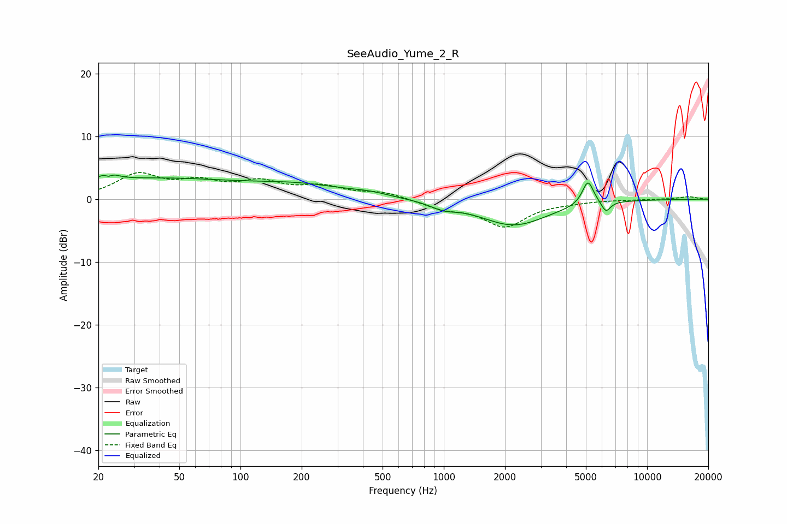

# SeeAudio_Yume_2_R
See [usage instructions](https://github.com/jaakkopasanen/AutoEq#usage) for more options and info.

### Parametric EQs
Apply preamp of -3.9 dB when using parametric equalizer.

|   # | Type    |   Fc (Hz) |    Q |   Gain (dB) |
|-----|---------|-----------|------|-------------|
|   1 | Peaking |        22 | 4.58 |         3.7 |
|   2 | Peaking |        22 | 6    |        -2.9 |
|   3 | Peaking |        43 | 0.26 |         3.4 |
|   4 | Peaking |        95 | 0.67 |        -0.4 |
|   5 | Peaking |       214 | 0.61 |         1.3 |
|   6 | Peaking |       434 | 1.56 |         0.5 |
|   7 | Peaking |       994 | 2.31 |        -0.9 |
|   8 | Peaking |      2210 | 0.85 |        -4.1 |
|   9 | Peaking |      5119 | 4.96 |         3.9 |
|  10 | Peaking |      6271 | 6    |        -1.7 |

### Fixed Band EQs
When using fixed band (also called graphic) equalizer, apply preamp of **-4.3 dB** (if available) and set gains manually with these parameters.

|   # | Type    |   Fc (Hz) |    Q |   Gain (dB) |
|-----|---------|-----------|------|-------------|
|   1 | Peaking |        31 | 1.41 |         3.7 |
|   2 | Peaking |        62 | 1.41 |         2.3 |
|   3 | Peaking |       125 | 1.41 |         2.4 |
|   4 | Peaking |       250 | 1.41 |         1.7 |
|   5 | Peaking |       500 | 1.41 |         1   |
|   6 | Peaking |      1000 | 1.41 |        -1.3 |
|   7 | Peaking |      2000 | 1.41 |        -4.2 |
|   8 | Peaking |      4000 | 1.41 |        -0.3 |
|   9 | Peaking |      8000 | 1.41 |        -0   |
|  10 | Peaking |     16000 | 1.41 |         0.4 |

### Graphs

