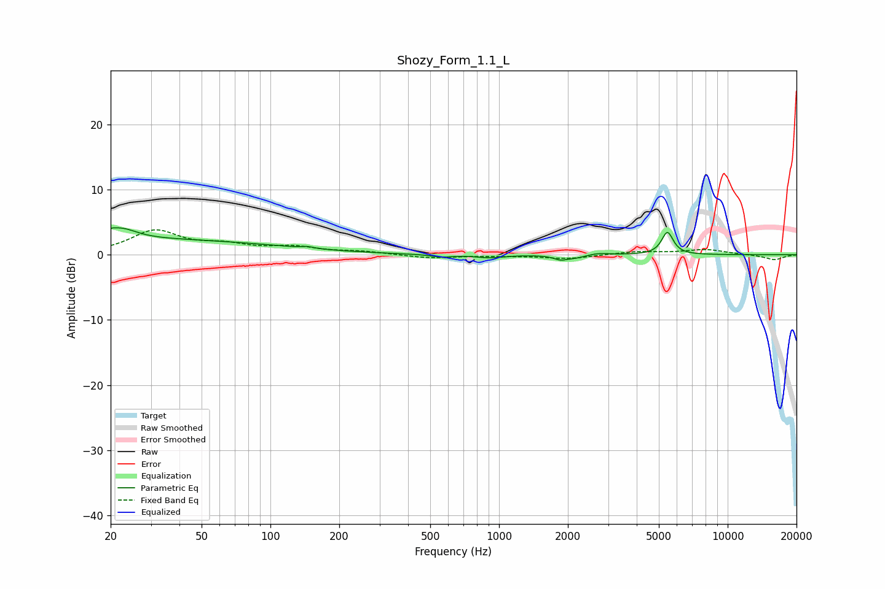

# Shozy_Form_1.1_L
See [usage instructions](https://github.com/jaakkopasanen/AutoEq#usage) for more options and info.

### Parametric EQs
Apply preamp of -4.2 dB when using parametric equalizer.

|   # | Type    |   Fc (Hz) |    Q |   Gain (dB) |
|-----|---------|-----------|------|-------------|
|   1 | Peaking |        20 | 5.89 |         0.4 |
|   2 | Peaking |        22 | 0.18 |         2.4 |
|   3 | Peaking |        22 | 2.2  |         1.6 |
|   4 | Peaking |       145 | 5.87 |         0.3 |
|   5 | Peaking |       561 | 3.01 |        -0.4 |
|   6 | Peaking |       915 | 2.33 |        -0.5 |
|   7 | Peaking |      1856 | 4.97 |        -0.6 |
|   8 | Peaking |      2157 | 2.98 |        -0.5 |
|   9 | Peaking |      2698 | 3    |         0.3 |
|  10 | Peaking |      5452 | 5.61 |         3.4 |

### Fixed Band EQs
When using fixed band (also called graphic) equalizer, apply preamp of **-3.9 dB** (if available) and set gains manually with these parameters.

|   # | Type    |   Fc (Hz) |    Q |   Gain (dB) |
|-----|---------|-----------|------|-------------|
|   1 | Peaking |        31 | 1.41 |         3.6 |
|   2 | Peaking |        62 | 1.41 |         1.2 |
|   3 | Peaking |       125 | 1.41 |         1   |
|   4 | Peaking |       250 | 1.41 |         0.4 |
|   5 | Peaking |       500 | 1.41 |        -0.5 |
|   6 | Peaking |      1000 | 1.41 |        -0.1 |
|   7 | Peaking |      2000 | 1.41 |        -0.6 |
|   8 | Peaking |      4000 | 1.41 |         0.5 |
|   9 | Peaking |      8000 | 1.41 |         0.8 |
|  10 | Peaking |     16000 | 1.41 |        -0.8 |

### Graphs

