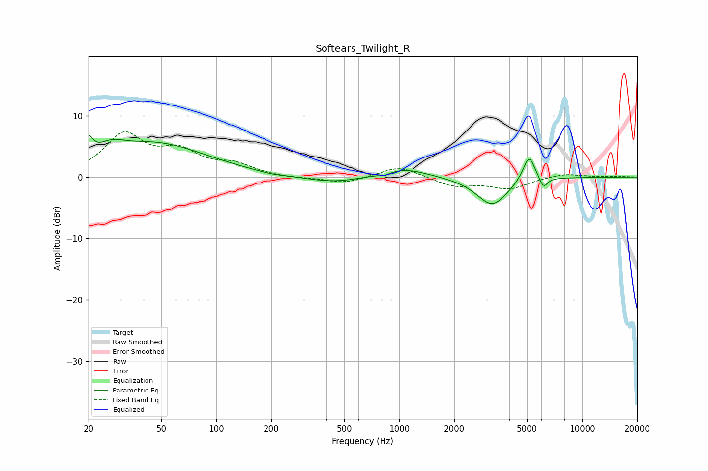

# Softears_Twilight_R
See [usage instructions](https://github.com/jaakkopasanen/AutoEq#usage) for more options and info.

### Parametric EQs
Apply preamp of -6.8 dB when using parametric equalizer.

|   # | Type    |   Fc (Hz) |    Q |   Gain (dB) |
|-----|---------|-----------|------|-------------|
|   1 | Peaking |        20 | 6    |         3   |
|   2 | Peaking |        26 | 1.9  |         1.9 |
|   3 | Peaking |        46 | 0.5  |         5.4 |
|   4 | Peaking |       201 | 1.89 |        -0.3 |
|   5 | Peaking |       433 | 0.91 |        -1   |
|   6 | Peaking |       830 | 5.7  |        -0.4 |
|   7 | Peaking |      1077 | 1.16 |         1.5 |
|   8 | Peaking |      3224 | 1.66 |        -4.7 |
|   9 | Peaking |      5126 | 4.12 |         4.4 |
|  10 | Peaking |      6141 | 6    |        -1.9 |

### Fixed Band EQs
When using fixed band (also called graphic) equalizer, apply preamp of **-7.5 dB** (if available) and set gains manually with these parameters.

|   # | Type    |   Fc (Hz) |    Q |   Gain (dB) |
|-----|---------|-----------|------|-------------|
|   1 | Peaking |        31 | 1.41 |         6.7 |
|   2 | Peaking |        62 | 1.41 |         3.6 |
|   3 | Peaking |       125 | 1.41 |         1.8 |
|   4 | Peaking |       250 | 1.41 |        -0.2 |
|   5 | Peaking |       500 | 1.41 |        -1.1 |
|   6 | Peaking |      1000 | 1.41 |         1.8 |
|   7 | Peaking |      2000 | 1.41 |        -1.5 |
|   8 | Peaking |      4000 | 1.41 |        -1.8 |
|   9 | Peaking |      8000 | 1.41 |         0.6 |
|  10 | Peaking |     16000 | 1.41 |         0.1 |

### Graphs

