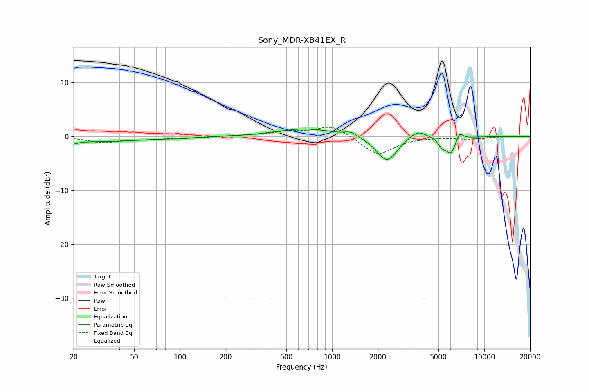

# Sony_MDR-XB41EX_R
See [usage instructions](https://github.com/jaakkopasanen/AutoEq#usage) for more options and info.

### Parametric EQs
Apply preamp of -1.5 dB when using parametric equalizer.

|   # | Type    |   Fc (Hz) |    Q |   Gain (dB) |
|-----|---------|-----------|------|-------------|
|   1 | Peaking |        20 | 5.99 |        -0.5 |
|   2 | Peaking |        26 | 0.38 |        -1   |
|   3 | Peaking |       102 | 2.81 |        -0.2 |
|   4 | Peaking |       672 | 0.8  |         1.5 |
|   5 | Peaking |      1328 | 3.31 |         0.8 |
|   6 | Peaking |      2293 | 2.1  |        -4.7 |
|   7 | Peaking |      3639 | 2.48 |         1.6 |
|   8 | Peaking |      5271 | 5.95 |        -1.3 |
|   9 | Peaking |      6027 | 4.19 |        -3.1 |
|  10 | Peaking |      6863 | 5.98 |         1.6 |

### Fixed Band EQs
When using fixed band (also called graphic) equalizer, apply preamp of **-1.8 dB** (if available) and set gains manually with these parameters.

|   # | Type    |   Fc (Hz) |    Q |   Gain (dB) |
|-----|---------|-----------|------|-------------|
|   1 | Peaking |        31 | 1.41 |        -1.1 |
|   2 | Peaking |        62 | 1.41 |        -0.4 |
|   3 | Peaking |       125 | 1.41 |        -0.3 |
|   4 | Peaking |       250 | 1.41 |         0.2 |
|   5 | Peaking |       500 | 1.41 |         0.7 |
|   6 | Peaking |      1000 | 1.41 |         2.1 |
|   7 | Peaking |      2000 | 1.41 |        -3.5 |
|   8 | Peaking |      4000 | 1.41 |        -0   |
|   9 | Peaking |      8000 | 1.41 |        -0.4 |
|  10 | Peaking |     16000 | 1.41 |        -0   |

### Graphs

