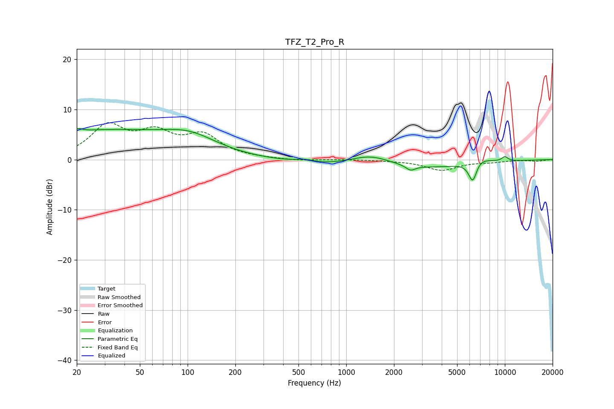

# TFZ_T2_Pro_R
See [usage instructions](https://github.com/jaakkopasanen/AutoEq#usage) for more options and info.

### Parametric EQs
Apply preamp of -6.3 dB when using parametric equalizer.

|   # | Type    |   Fc (Hz) |    Q |   Gain (dB) |
|-----|---------|-----------|------|-------------|
|   1 | Peaking |        20 | 5.87 |         0.6 |
|   2 | Peaking |        28 | 0.29 |         5.6 |
|   3 | Peaking |       103 | 0.82 |         2.9 |
|   4 | Peaking |       542 | 2.51 |         0.5 |
|   5 | Peaking |      1419 | 1.03 |         2.6 |
|   6 | Peaking |      1840 | 0.28 |        -2.2 |
|   7 | Peaking |      2545 | 4.93 |        -1   |
|   8 | Peaking |      6272 | 5.18 |        -4.2 |
|   9 | Peaking |      6874 | 2.06 |         1.4 |
|  10 | Peaking |     10000 | 5.98 |         0.9 |

### Fixed Band EQs
When using fixed band (also called graphic) equalizer, apply preamp of **-7.5 dB** (if available) and set gains manually with these parameters.

|   # | Type    |   Fc (Hz) |    Q |   Gain (dB) |
|-----|---------|-----------|------|-------------|
|   1 | Peaking |        31 | 1.41 |         6.3 |
|   2 | Peaking |        62 | 1.41 |         4.5 |
|   3 | Peaking |       125 | 1.41 |         4.4 |
|   4 | Peaking |       250 | 1.41 |         0.2 |
|   5 | Peaking |       500 | 1.41 |        -0.3 |
|   6 | Peaking |      1000 | 1.41 |         0   |
|   7 | Peaking |      2000 | 1.41 |        -0.1 |
|   8 | Peaking |      4000 | 1.41 |        -2.1 |
|   9 | Peaking |      8000 | 1.41 |        -0.4 |
|  10 | Peaking |     16000 | 1.41 |        -0.3 |

### Graphs

