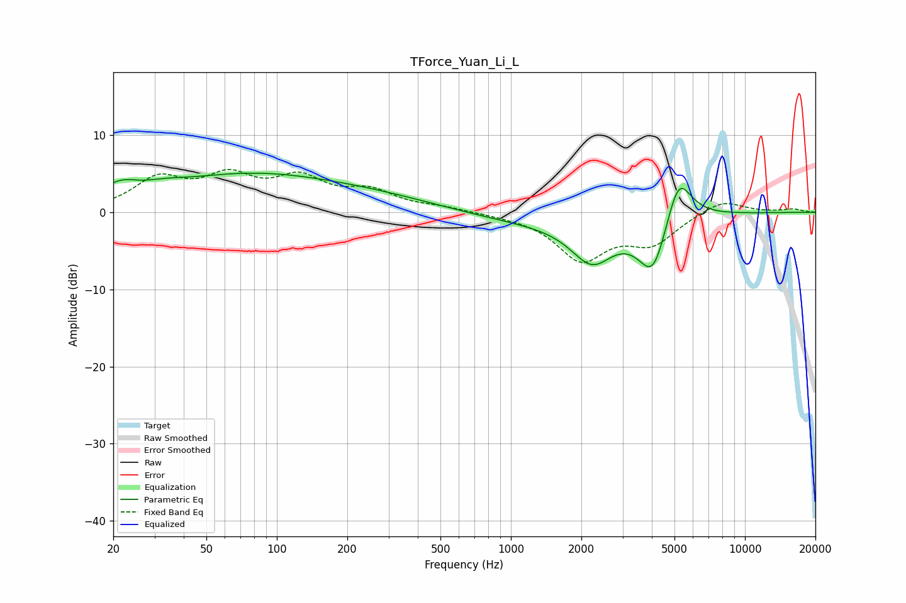

# TForce_Yuan_Li_L
See [usage instructions](https://github.com/jaakkopasanen/AutoEq#usage) for more options and info.

### Parametric EQs
Apply preamp of -5.2 dB when using parametric equalizer.

|   # | Type    |   Fc (Hz) |    Q |   Gain (dB) |
|-----|---------|-----------|------|-------------|
|   1 | Peaking |        20 | 5.4  |         0.2 |
|   2 | Peaking |        22 | 2.01 |         1.8 |
|   3 | Peaking |        33 | 1.55 |         0.7 |
|   4 | Peaking |        75 | 0.37 |         4.7 |
|   5 | Peaking |       287 | 0.5  |         1.3 |
|   6 | Peaking |      1273 | 0.46 |        -1.3 |
|   7 | Peaking |      2223 | 1.55 |        -5.3 |
|   8 | Peaking |      4050 | 2.16 |        -7.8 |
|   9 | Peaking |      5190 | 3.08 |         3.5 |
|  10 | Peaking |      5200 | 1.94 |         3.4 |

### Fixed Band EQs
When using fixed band (also called graphic) equalizer, apply preamp of **-5.7 dB** (if available) and set gains manually with these parameters.

|   # | Type    |   Fc (Hz) |    Q |   Gain (dB) |
|-----|---------|-----------|------|-------------|
|   1 | Peaking |        31 | 1.41 |         4   |
|   2 | Peaking |        62 | 1.41 |         4   |
|   3 | Peaking |       125 | 1.41 |         3.9 |
|   4 | Peaking |       250 | 1.41 |         2.4 |
|   5 | Peaking |       500 | 1.41 |         0.5 |
|   6 | Peaking |      1000 | 1.41 |        -0.2 |
|   7 | Peaking |      2000 | 1.41 |        -5.9 |
|   8 | Peaking |      4000 | 1.41 |        -3.7 |
|   9 | Peaking |      8000 | 1.41 |         1.8 |
|  10 | Peaking |     16000 | 1.41 |         0.4 |

### Graphs

