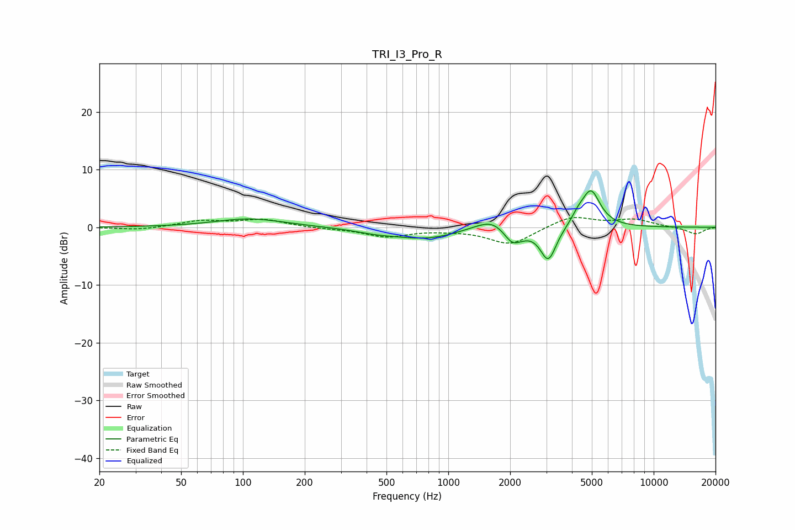

# TRI_I3_Pro_R
See [usage instructions](https://github.com/jaakkopasanen/AutoEq#usage) for more options and info.

### Parametric EQs
Apply preamp of -6.4 dB when using parametric equalizer.

|   # | Type    |   Fc (Hz) |    Q |   Gain (dB) |
|-----|---------|-----------|------|-------------|
|   1 | Peaking |       108 | 0.85 |         1.5 |
|   2 | Peaking |       444 | 1.34 |        -0.6 |
|   3 | Peaking |       776 | 0.93 |        -1.8 |
|   4 | Peaking |      1419 | 1.71 |         0.6 |
|   5 | Peaking |      1641 | 2.32 |         1.4 |
|   6 | Peaking |      2042 | 3.62 |        -2.2 |
|   7 | Peaking |      2259 | 3.25 |        -0.6 |
|   8 | Peaking |      3069 | 3.61 |        -5.8 |
|   9 | Peaking |      4285 | 4.25 |         1.3 |
|  10 | Peaking |      4951 | 3.08 |         6.3 |

### Fixed Band EQs
When using fixed band (also called graphic) equalizer, apply preamp of **-1.8 dB** (if available) and set gains manually with these parameters.

|   # | Type    |   Fc (Hz) |    Q |   Gain (dB) |
|-----|---------|-----------|------|-------------|
|   1 | Peaking |        31 | 1.41 |        -0.5 |
|   2 | Peaking |        62 | 1.41 |         1.1 |
|   3 | Peaking |       125 | 1.41 |         1.3 |
|   4 | Peaking |       250 | 1.41 |        -0.2 |
|   5 | Peaking |       500 | 1.41 |        -1.6 |
|   6 | Peaking |      1000 | 1.41 |        -0.3 |
|   7 | Peaking |      2000 | 1.41 |        -3   |
|   8 | Peaking |      4000 | 1.41 |         2   |
|   9 | Peaking |      8000 | 1.41 |         1.3 |
|  10 | Peaking |     16000 | 1.41 |        -1.2 |

### Graphs

