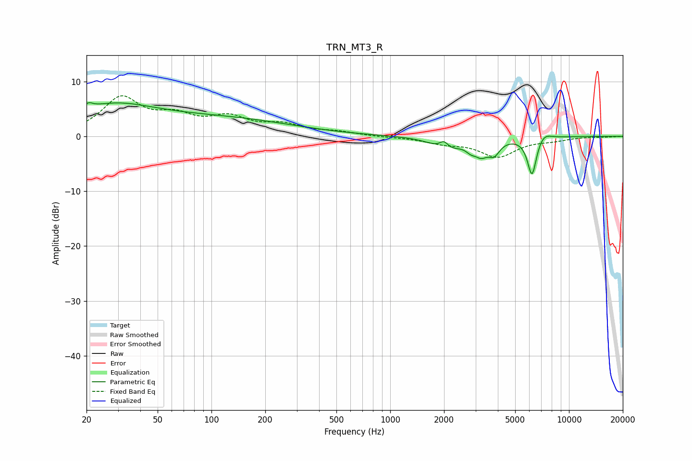

# TRN_MT3_R
See [usage instructions](https://github.com/jaakkopasanen/AutoEq#usage) for more options and info.

### Parametric EQs
Apply preamp of -6.2 dB when using parametric equalizer.

|   # | Type    |   Fc (Hz) |    Q |   Gain (dB) |
|-----|---------|-----------|------|-------------|
|   1 | Peaking |        20 | 5.8  |         1   |
|   2 | Peaking |        27 | 0.58 |         5.1 |
|   3 | Peaking |       119 | 0.36 |         2.9 |
|   4 | Peaking |      1998 | 5.42 |         1.7 |
|   5 | Peaking |      2062 | 1.83 |        -2.5 |
|   6 | Peaking |      2829 | 4.97 |        -1.2 |
|   7 | Peaking |      3230 | 4.11 |        -2.2 |
|   8 | Peaking |      3807 | 4.27 |        -2.5 |
|   9 | Peaking |      6210 | 5.37 |        -7.1 |
|  10 | Peaking |      7209 | 3.44 |         1.3 |

### Fixed Band EQs
When using fixed band (also called graphic) equalizer, apply preamp of **-7.5 dB** (if available) and set gains manually with these parameters.

|   # | Type    |   Fc (Hz) |    Q |   Gain (dB) |
|-----|---------|-----------|------|-------------|
|   1 | Peaking |        31 | 1.41 |         6.7 |
|   2 | Peaking |        62 | 1.41 |         3   |
|   3 | Peaking |       125 | 1.41 |         3   |
|   4 | Peaking |       250 | 1.41 |         1.8 |
|   5 | Peaking |       500 | 1.41 |         0.7 |
|   6 | Peaking |      1000 | 1.41 |        -0.1 |
|   7 | Peaking |      2000 | 1.41 |        -1.1 |
|   8 | Peaking |      4000 | 1.41 |        -3.6 |
|   9 | Peaking |      8000 | 1.41 |        -0.6 |
|  10 | Peaking |     16000 | 1.41 |        -0.1 |

### Graphs

